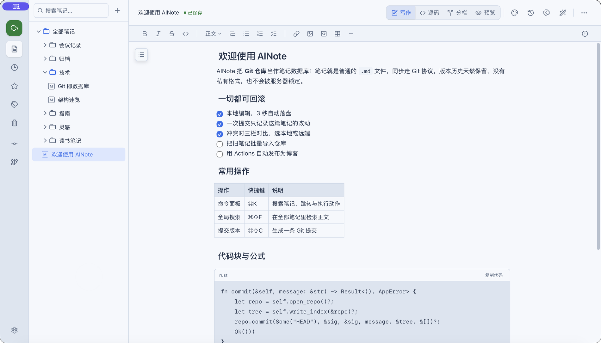
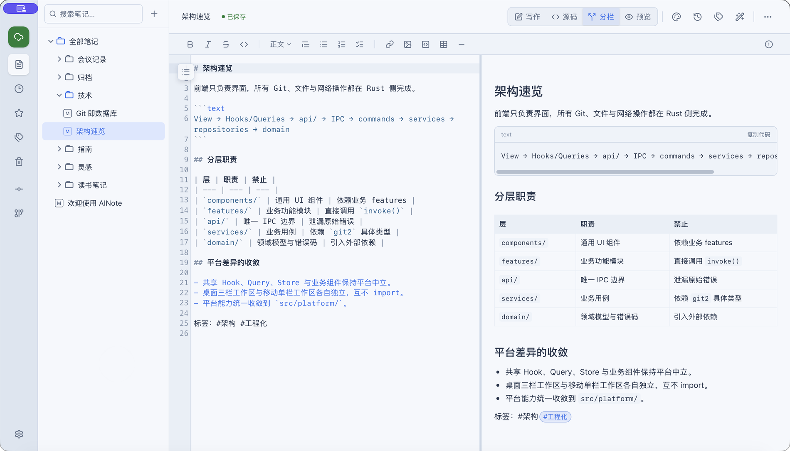
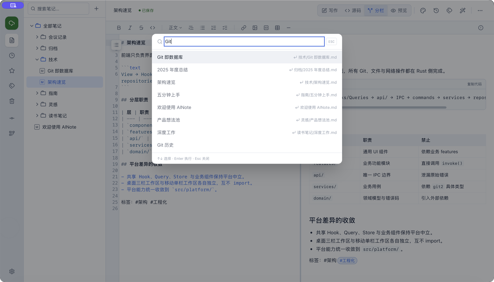
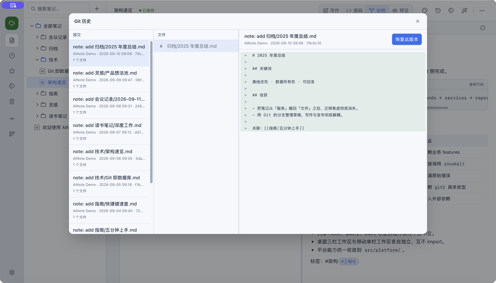
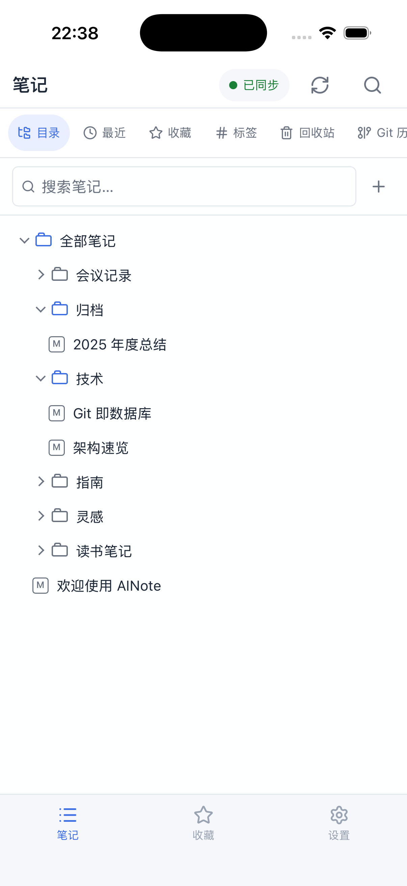
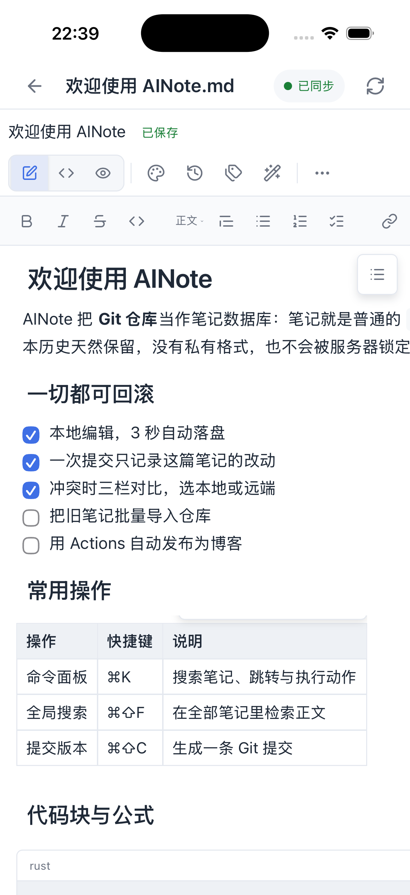
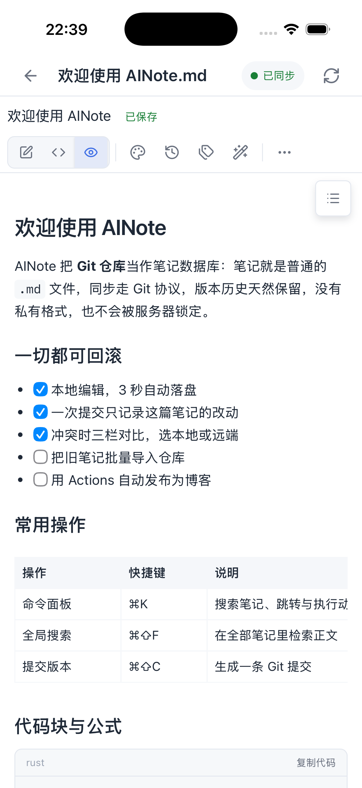

# AINote

[](https://github.com/small-dream/AINote/releases/latest)
[](https://github.com/small-dream/AINote/releases/latest)
[](https://v2.tauri.app/)

**简体中文** · [English](README.en-US.md)

AINote 是一款面向开发者与知识工作者的跨平台 Markdown 笔记应用。它把「Git 仓库」当作笔记数据库：你的笔记是普通 `.md` 文件，同步走 Git 协议，版本历史天然保留，没有私有格式和服务器锁定。

## 界面预览

### 桌面端

**写作模式**：CodeMirror 软渲染随写随排版，标题、任务列表、表格、公式和代码块都在原地呈现。



**分栏模式**：左边是 100% 保真的 Markdown 源码，右边是实时预览，改哪边都同步。



**命令面板（⌘K）**：一次按键即可跳转笔记、执行命令。



**版本历史**：每次保存都留下一条 Git 提交，可查看 Diff 并一键恢复。



### 移动端（iOS / Android）

同一套笔记、同一套数据格式，离线可写，回到前台自动同步。

<p align="center">
  
  
  
</p>

## 为什么选择 AINote

- **数据所有权**：笔记保存在你自己的 GitHub 仓库中，可以随时迁移、审计、备份和回滚。
- **离线优先**：浏览、搜索、编辑和本地提交不依赖网络；联网后再推送或拉取。
- **本地优先的 AI**：支持 OpenAI 兼容 API 与本地 Ollama，Provider 与模型可插拔，API Key 加密存储。
- **原生性能**：React 前端与 Rust/Tauri 后端分离，Git、文件和网络操作都运行在原生层。

## 核心特性

- **Markdown 编辑**：CodeMirror 软渲染提供 Typora 式所见即所得体验；源码保存 100% 保真。
- **富文本笔记**：可选 `.ainote` 笔记类型，基于 TipTap 支持表格、图片、任务列表、斜杠命令和 Markdown 互转。
- **GitHub 同步**：通过 OAuth Device Flow 或 PAT 绑定已有/新建仓库，一键提交、推送、拉取。
- **冲突处理**：提供本地/合并结果/远端三栏可视化合并界面。
- **版本历史**：查看单篇笔记的提交历史、Diff，并恢复到指定版本。
- **知识网络**：支持 `[[Wiki 双链]]`、反向链接、`#标签`、全文搜索和命令面板。
- **资产管理**：拖放导入图片/附件到仓库 `assets/`，并自动插入可移植引用。
- **导入导出**：导入 Markdown 文件，导出 A4 排版 PDF。
- **多仓库与主题**：管理多个笔记仓库；支持亮色/暗色/跟随系统、八套阅读主题和排版偏好。
- **界面语言**：应用内可切换简体中文与 English。

## 下载安装

从 [GitHub Releases](https://github.com/small-dream/AINote/releases/latest) 选择对应平台：

| 平台 | 推荐安装包 |
|---|---|
| macOS（Apple Silicon） | `.dmg` |
| Windows | `.msi` 或 `.exe` |
| Linux | `.AppImage`、`.deb` 或 `.rpm` |

当前安装包尚未进行 Apple 公证和 Windows 代码签名，首次打开可能需要手动放行；完整步骤见 [安装与故障排查](docs/TROUBLESHOOTING.md)：

- **macOS**：若提示“应用已损坏”，把 `AINote.app` 移到 `/Applications` 后执行 `xattr -cr /Applications/AINote.app`。
- **Windows**：首次运行可能出现 SmartScreen 提示；请确认安装包来自本项目官方 Release 页面。

应用内置签名校验的自动更新器，也可以在 **设置 → 软件更新** 中手动检查。安装包校验（SHA256 / GPG）、同步失败、凭证失效、磁盘不足等排查步骤同样见上述文档。

> AINote 仍处于快速迭代阶段。虽然笔记保存在标准 Git 仓库中，升级前仍建议推送远端或完成一次本地备份。

## 本地开发

### 准备环境

- Node.js 22
- pnpm 10.33.0
- Rust stable
- Tauri 2 的[平台依赖](https://v2.tauri.app/start/prerequisites/)

### 启动与构建

```bash
git clone https://github.com/small-dream/AINote.git
cd AINote
pnpm install

# 开发模式：Vite 热更新 + Rust 增量编译
pnpm desktop:run

# 构建 Release 可执行文件，不打包安装包
pnpm desktop:build

# 产出当前平台的安装包
pnpm desktop:bundle
```

### 质量检查

```bash
pnpm build
pnpm test
pnpm lint
cargo test --manifest-path src-tauri/Cargo.toml
```

端到端测试使用 `pnpm test:e2e`。

## 技术架构

AINote 采用单向分层架构：

```text
View → Hooks/Queries → api/ → IPC → commands → services → repositories → domain
```

- 前端：React 19、TypeScript strict、Vite、Tailwind CSS、TanStack Query 和 Zustand。
- 桌面层：Tauri 2、Rust、`git2`、AES-GCM 加密存储。
- 编辑器：CodeMirror 6（Markdown）与 TipTap（富文本）。
- 数据：本地 Git 仓库是唯一权威数据源；同步协议是 Git，而不是私有云接口。

更多细节见 [产品路线图](docs/ROADMAP.md)、[架构文档](docs/ARCHITECTURE.md)、[产品需求文档](docs/PRD.md)、[编码规范](docs/CODING_STANDARDS.md) 和 [更新日志](docs/CHANGELOG.md)。

## 参与贡献

欢迎提交 Issue 与 Pull Request。开始前请阅读对应文档，保持现有架构边界：

1. 在 GitHub 上 Fork 仓库，或创建工作分支。
2. 修改需求或架构前，先更新对应 `docs/` 活文档。
3. 交付代码时同步补充核心逻辑测试。
4. 确保上面的质量检查全部通过。
5. 提交信息使用 `type(scope): summary` 格式，例如 `feat(note): add tag suggestions`。

## 安全

- GitHub Token 与 AI Provider API Key 不会以明文落盘，前端也无法读取明文。
- Markdown 渲染默认不解析原始 HTML，降低 XSS 风险。
- 请勿在 Issue、截图或提交中泄漏 Token、API Key 和私人笔记数据。

### 隐私与诊断数据

- 本地日志只写入本机应用日志目录，写入前统一脱敏，不记录 Token、API Key 或笔记正文；可在「设置 → 诊断与反馈」随时关闭或清理。
- 导出诊断包只含应用版本、平台、脱敏日志与计数摘要，不含笔记内容、仓库路径或凭证；仅在用户主动点击时生成，不会自动上传。
- M1 阶段不做远程崩溃上报；如需反馈问题，请手动把诊断包附到 GitHub Issue。
- 应用默认在本机记录少量使用事件（启动、绑定仓库、创建笔记、同步成功 / 失败、AI 落笔、检查更新），只有事件名与时间，不含笔记内容、路径与凭证；可在「设置 → 诊断与反馈」一键关闭或清空，且没有任何远程上报。

完整的采集范围、存储位置、关闭与删除方式见 [`docs/PRIVACY.md`](docs/PRIVACY.md)。

如需报告安全漏洞，请优先使用 GitHub 的 [私下安全报告](https://github.com/small-dream/AINote/security/advisories/new)，不要直接创建公开 Issue。

## License

AINote is released under the [MIT License](LICENSE).
