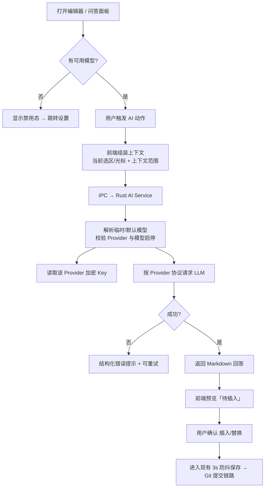

# AINote — AI 功能产品设计（PM）

> 版本：v0.1（P0 草案）· 状态：已确认 · 维护：PM
> 本文档为 AI 能力的详细设计；范围与优先级并入 `docs/PRD.md`。技术实现见 `docs/ARCHITECTURE.md`。

## 1. 背景与定位

**背景**：AINote 是「Git 即数据库」的本地优先 Markdown 笔记软件，用户掌握全部数据与版本历史。AI 能力应延续这一价值观——**作为写作增强与知识问答助手存在，而不是把数据迁往封闭云服务**。

**一句话定位**：在你自己的笔记上运行的可选 AI 助手——写作时随叫随到，提问时基于你的笔记作答，所有请求由你显式触发、结果由你确认落笔。

**目标受众（与主产品一致）**：开发者、技术写作者、重度知识管理者。他们需要 AI 辅助但重视数据主权与隐私。

**设计原则**：

1. **本地优先、隐私默认**：不自动上传全文；只在用户触发动作时发送所需上下文；支持云端 API 与本地模型两种 Provider。
2. **可选能力**：未配置 AI 时产品完整可用，不出现打扰性入口；AI 功能集中一处配置与开关。
3. **结果可控**：AI 输出先进入「待插入」预览，用户确认后落笔；所有落笔内容照常进入现有防抖保存与 Git 版本化链路。
4. **可插拔 Provider**：统一走 OpenAI 兼容 chat completions 协议（OpenAI 官方 / 任意兼容网关 / Ollama 本地端点），不绑定单一厂商。
5. **与现有系统同构**：AI 输出是合法 Markdown / TipTap JSON，可被渲染、全文搜索、`#标签` 与 `[[双链]]` 索引。

## 2. 功能全景与优先级

### P0（MVP 闭环，本次交付）

| ID | User Story | 验收要点 |
|---|---|---|
| P0-AI-1 | 作为用户，我可以在「设置 → AI」管理 AI Provider 与模型 | 支持多个 Provider 连接（OpenAI 兼容 API / Ollama）；每个 Provider 下添加多个模型并独立启用；Provider 与模型支持启停；设置全局默认模型；可拉取 OpenAI 兼容 `/models`；API Key 按 Provider 加密存储，前端拿不到明文；无可用模型时入口引导去设置 |
| P0-AI-2 | 作为用户，我可以在编辑器中选中文本，一键完成「润色 / 翻译 / 缩写 / 扩写」 | Markdown（CodeMirror）与富文本（TipTap）编辑器均有选中态气泡入口；结果以「替换选中」方式落笔；请求中有加载态，可取消；失败可重试 |
| P0-AI-3 | 作为用户，我可以在光标处让 AI 续写当前笔记 | 未选中文本时入口为「续写」；结果插入光标处并保持编辑器焦点 |
| P0-AI-4 | 作为用户，我可以打开「AI 问答」面板，基于笔记提问 | 上下文范围可在「当前笔记」与「当前笔记 + 全库关键词检索」间切换；回答以 Markdown 渲染（走既有 sanitize 管线）；可一键把回答插入当前笔记末尾 |

### P1（迭代）

| ID | User Story |
|---|---|
| P1-AI-1 | 流式输出（打字机效果，降低等待感知） ✅ 已实现：写作与问答均走 Tauri Channel 流式（`ai_generate_stream` / `ai_chat_stream`，SSE 增量经 `repositories/llm.rs` 解析） |
| P1-AI-2 | 一键生成笔记摘要（写入 frontmatter `summary`，可再次覆盖） ✅ 已实现：Markdown 笔记 AI 菜单「生成摘要」，确认后写入 frontmatter `summary`（纯函数 `upsertFrontmatterSummary`）；富文本编辑器中摘要可插入光标处 |
| P1-AI-3 | 生成标题 / 大纲建议 ✅ 已实现：AI 菜单「生成标题建议」经流式接口产出每行一个候选，`parseTitleSuggestions` 解析后单选应用（替换笔记首行 `# 标题`，无标题则文首插入）；「生成大纲建议」产出 Markdown 层级大纲，预览后一键插入文末（源文本截断至 6000 字符控制 token） |
| P1-AI-4 | 标签与双链建议（复用 wiki 索引与现有 `#标签` / `[[双链]]` 体系） |
| P1-AI-5 | 代码块解释 / 生成（识别代码语言上下文） |

### P2（远期）

| ID | User Story |
|---|---|
| P2-AI-1 | 笔记库语义问答（embedding + 向量检索，超越关键词 top-k） |
| P2-AI-2 | 每日回顾 / 闪卡生成 |
| P2-AI-3 | 本地模型管理（模型下载 / 切换 / 离线可用） |
| P2-AI-4 | 多模型对比与 A/B 选择 |

## 3. 核心业务流程

## 4. 关键业务规则

- **隐私与数据边界**
  - 上下文默认仅当前笔记；「全库上下文」仅取关键词检索 top-k 命中段落（默认 5 段），绝不发送整个仓库。
  - 每次 AI 请求都必须是用户显式触发；禁止隐式/后台自动改写。
  - API Key 只存本地加密文件，绝不落盘明文、绝不提交仓库，前端永远拿不到明文。
- **Provider 兼容**
  - 统一使用 OpenAI 兼容 `chat/completions` 协议；Ollama 通过其 `/v1` OpenAI 兼容端点接入。
  - 请求体与响应结构收敛在 Rust Repository 层，Service 不感知厂商差异。
- **Provider 与模型路由**
  - 设置数据使用 `schemaVersion: 2`；v1 单配置首次读取时迁移为一个 Provider 和一个默认模型。
  - 模型可选择的前提是：全局 AI 启用、Provider 启用、模型启用；云端 Provider 还必须有 Key。
  - 全局默认模型只允许指向存在的模型。默认不可用时，前端自动选中第一个可用模型并在选择器中明示；Rust 端不会静默替换失效请求。
  - AI 菜单与问答面板的选择是本次请求的临时选择；「设为默认」仍需在设置页显式保存。
- **超时与重试**
  - 单次请求超时 90s（长于 GitHub API 的 15s，适配长文本生成）。
  - 网络类错误标记 `retriable: true`，前端可重试；计费请求不自动重试。
- **输出落笔规则**
  - AI 结果先进入「待插入」预览态，用户确认后才写入编辑器；富文本经转换以 TipTap 语义插入，Markdown 直接替换选区 / 插入光标。
  - 落笔后自然进入现有防抖自动保存与 `note: auto commit` Git 链路，AI 生成内容同样可版本回溯。
- **安全**
  - AI 回答以 Markdown 渲染时，必须复用与预览一致的 sanitize 管线，禁止执行 AI 返回的任意 HTML。
  - 上下文拼接在 Rust 侧完成（不把原始库文件路径/内容泄漏到日志）。
- **成本控制**
  - 不内置计费额度；提示词模板统一收敛在前端 `features/ai/utils/prompts.ts`（纯函数，可单测、可审计）。
  - 全库上下文请求的发送 token 量受 top-k 段落数与单段字符上限约束。

## 5. 成功指标

- 首次配置 AI 时长 < 2 分钟（从打开设置到发起第一次 AI 动作）。
- AI 动作平均响应（非流式）< 10s（P0）；P1 流式后首 token < 2s。
- AI 输出「确认落笔」比例 ≥ 80%（通过插入/替换按钮点击率间接衡量，衡量生成质量）。
- 全库上下文单次请求发送 token ≤ 8000（防误发大仓库，兼顾质量与成本）。
