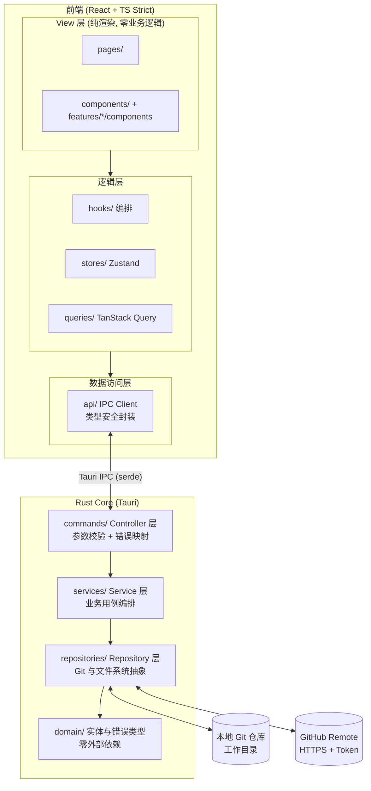

# MyNote — 架构文档 (ARCHITECTURE)

> 版本：v0.1 · 状态：已确认 · 维护：架构师
> 本文档为活文档。任何技术选型或分层规则的变更必须先更新本文档。

## 0. 工程基线

- **包管理器：pnpm**（前端 workspace 唯一包管理器，禁止混用 npm/yarn）。
- **常用脚本**：
  - `pnpm desktop:run` — 开发模式运行桌面应用（`tauri dev`，前端热更新 + Rust 增量编译）
  - `pnpm desktop:build` — 编译 Release 可执行文件，不打安装包（`tauri build --no-bundle`，用于快速验证）
  - `pnpm desktop:bundle` — 编译并产出各平台安装包（`tauri build`，dmg/msi/deb 等）
  - `pnpm build` / `pnpm test` / `pnpm lint` — 前端构建 / 单测 / 静态检查（CI 门槛）
- **依赖版本策略：一律使用最新稳定版**（`^latest`），升级后必须通过 `pnpm build && pnpm test && pnpm lint` 与 `cargo test` 全量验证。
  - 唯一例外：`typescript` 锁定 `~6.0`——typescript-eslint 8.x 尚不支持 TS 7.x 编译器（见 typescript-eslint#10940），待其支持后立即升级。
- Rust 依赖同样使用最新 stable major（tauri 2 / git2 0.20 / thiserror 2 / keyring 3）。

## 1. 技术选型

| 层 | 选型 | 理由（为何最适合 AI 高频修改） |
|---|---|---|
| 跨平台壳 | **Tauri 2** | 一套代码覆盖 macOS/Windows/Linux/iOS/Android；Web 前端 + Rust 后端边界清晰；包体小、性能好 |
| 前端框架 | **React 18 + TypeScript (strict)** | 生态最大、AI 语料最丰富；`strict` 让 AI 改动被编译器即时校验 |
| 构建 | **Vite** | 快，配置声明式 |
| 编辑器 | **CodeMirror 6** | 模块化按需引入（拒绝 Monaco 巨石），Markdown 高亮/快捷键成熟 |
| 样式 | **Tailwind CSS 4（CSS-first 配置）+ CSS Variables** | 原子类声明式，设计 Token 集中管理（`src/styles/tokens.css` + `@theme` 映射） |
| Git 引擎 | **Rust 后端 `git2` (libgit2)** | 完整离线 Git 能力（commit/pull/push/merge），移动端可用 |
| 前后端桥 | **Tauri Commands (IPC) + `serde`** | Rust 强类型入参/出参，TS 侧镜像类型，双向类型安全 |
| GitHub 接入 | **OAuth Device Flow / PAT + GitHub REST API** | 仅用于仓库创建与授权验证；数据同步走纯 Git 协议 |
| 前端状态 | **Zustand（全局 UI 态）+ TanStack Query（服务端/Git 态）** | 轻量、无样板、职责边界清晰 |
| 凭证 | **`keyring` crate（系统钥匙串）** | Token 不落盘明文；登录态布尔标记可落盘到 app config |
| 测试 | **Vitest + React Testing Library + `cargo test`** | 前后端同构的快测试 |

**核心架构决策**：所有 Git / 文件 IO 放在 Rust 层，前端只做「纯 UI + 状态编排」。
收益：(1) 前端 100% 可在 Vitest/jsdom 中测试；(2) AI 修改前端永远触碰不到高风险原生层；
(3) Git 行为收敛在 Repository 层，可单测、可替换。

## 2. 系统架构



## 3. 分层职责与防腐化规则

### Rust Core（后端）

- `commands/`（Controller）：一命令一文件。只做参数反序列化、调用 Service、把 `Result<T, AppError>` 返回给前端。**禁止出现业务逻辑**。
- `services/`（Service）：一个业务用例一个文件/模块。编排 Repository，实现 PRD 中的业务规则（如防抖提交策略）。
- `repositories/`：trait 与实现分离。`git_backend.rs` 定义 `GitBackend` trait，`git2_backend.rs`（本地操作）+ `git2_remote.rs`（网络操作）是 libgit2 实现；`file_storage.rs` / `note_files.rs` / `file_tree.rs` 为文件系统访问（受 200 行上限拆分）。未来可换实现，Service 零感知。
- `domain/`：实体（`Note`）、值对象、统一错误 `AppError`。**零外部依赖**，不 import git2 / tauri。

### 前端

- `pages/`：页面级组件只做组装，< 50 行。
- `features/<domain>/`：按领域垂直切分（note / file-tree / sync / settings…），每个 feature 内含 `components/` `hooks/` `utils/` `types.ts`。**新增功能 = 新增 feature 目录，禁止向既有 feature 堆砌**。
- `components/`（atoms/molecules）：业务无关基础组件，不 import 任何 feature。
- `api/`：**前端唯一跨边界点**。组件永远 `import { noteApi } from '@/api'`，严禁在组件中直接 `invoke()`。
- `stores/` 与 `queries/` 职责见 `CODING_STANDARDS.md` 第 2 节。

### 依赖方向（强制）

```text
View → Hooks/Queries → api/ → IPC → commands → services → repositories → domain
```

- 禁止反向依赖；`domain/` 不依赖任何其他层。
- 前端 `components/`（通用组件）不得依赖 `features/`。
- ESLint `no-restricted-imports` 机器强制上述边界。

## 4. 目录结构

```text
MyNote/
├── docs/
│   ├── PRD.md
│   ├── ARCHITECTURE.md
│   └── CODING_STANDARDS.md
├── src/                          # 前端 (React)
│   ├── main.tsx
│   ├── app/
│   │   ├── router.tsx            # 路由表 (唯一集中声明处)
│   │   └── providers.tsx         # QueryClient/Theme 等 Provider 组装
│   ├── pages/                    # 页面级组件, 只做组装
│   │   ├── workspace/index.tsx
│   │   └── setup/index.tsx
│   ├── features/                 # 按领域垂直切分 (核心防腐化手段)
│   │   ├── note/
│   │   │   ├── components/       # 每个组件 < 150 行
│   │   │   ├── hooks/            # 状态/副作用/IPC 编排全部在此
│   │   │   ├── utils/            # 纯函数
│   │   │   └── types.ts
│   │   ├── file-tree/
│   │   ├── sync/
│   │   ├── auth/                 # 登录（Token 校验/保存）
│   │   └── repo/                 # 绑定/创建仓库
│   ├── components/               # 业务无关组件
│   │   ├── atoms/
│   │   └── molecules/
│   ├── api/                      # IPC Client, 一领域一文件
│   │   ├── client.ts             # invoke 薄封装 + 错误统一转换
│   │   ├── types.ts              # 与 Rust DTO 结构一致的镜像类型
│   │   ├── note.api.ts / repo.api.ts / sync.api.ts / auth.api.ts
│   ├── stores/                   # Zustand, 按领域切片
│   ├── queries/                  # TanStack Query hooks (服务端/Git 状态)
│   ├── hooks/                    # 跨领域通用 hooks（useNetworkStatus 等）
│   ├── lib/                      # 纯工具函数, 无 React 依赖
│   └── styles/
│       └── tokens.css            # 设计 Token (明暗双主题)
├── src-tauri/                    # Rust Core
│   ├── src/
│   │   ├── main.rs               # 仅做 Command 注册, < 50 行
│   │   ├── commands/             # Controller: 一命令一文件
│   │   │   ├── mod.rs            # 仅 re-export
│   │   │   ├── note/             # create.rs / read.rs / update.rs / delete.rs / move.rs / tree.rs / list.rs
│   │   │   ├── git/              # commit.rs / pull.rs / push.rs / status.rs / sync.rs / resolve.rs
│   │   │   ├── repo/             # bind.rs / create.rs / validate.rs / path.rs
│   │   │   └── auth/             # save_token.rs / validate.rs / status.rs / logout.rs
│   │   ├── services/             # 一用例一模块
│   │   ├── repositories/         # trait + 实现分离
│   │   ├── domain/               # 实体、值对象、AppError
│   │   └── config/
│   └── Cargo.toml
├── package.json / tsconfig.json (strict: true)
└── 根级配置 (eslint / prettier / tailwind)
```

## 5. 关键运行时设计

- **自动提交防抖**：编辑器变更 → 前端 30s 防抖落盘 → `sync_service.commit_pending()` 汇总未提交变更生成单条 commit。策略细节由 Service 层实现，Controller 不感知。
- **离线优先**：所有读写只操作本地仓库；Push/Pull 失败进入待同步状态，网络恢复事件触发重试（前端 `online` 事件 + Query 重取）。
- **凭证流**：Token 只存系统钥匙串；Rust 层在使用时读取，前端永远拿不到明文 Token。
- **登录态**：`has_token` 这类非敏感状态存于 app config，路由守卫不直接探测钥匙串。
- **长耗时 IPC**：Git / 文件 / 网络类 Command 统一通过 `async command + spawn_blocking` 执行，避免阻塞前端渲染与交互。
