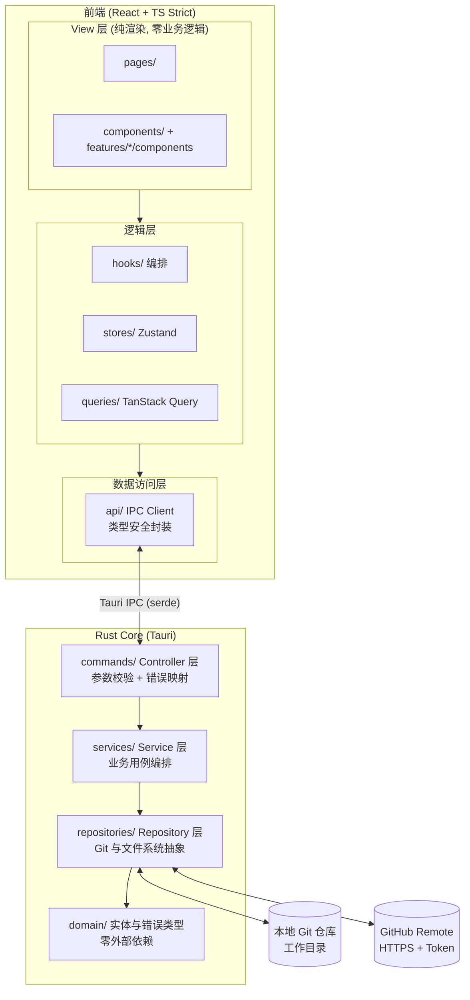

# AINote — 架构文档 (ARCHITECTURE)

> 版本：v0.1 · 状态：已确认 · 维护：架构师
> 本文档为活文档。任何技术选型或分层规则的变更必须先更新本文档。

## 0. 工程基线

- **包管理器：pnpm**（前端 workspace 唯一包管理器，禁止混用 npm/yarn）。
- **常用脚本**：
  - `pnpm desktop:run` — 开发模式运行桌面应用（`tauri dev`，前端热更新 + Rust 增量编译）
  - `pnpm desktop:build` — 编译 Release 可执行文件，不打安装包（`tauri build --no-bundle`，用于快速验证）
  - `pnpm desktop:bundle` — 编译并产出各平台安装包（`tauri build`，dmg/msi/deb 等）
  - `pnpm build` / `pnpm test` / `pnpm lint` — 前端构建 / 单测 / 静态检查（CI 门槛）
- **依赖版本策略：一律使用最新稳定版**（`^latest`），升级后必须通过 `pnpm build && pnpm test && pnpm lint` 与 `cargo test` 全量验证。
  - 唯一例外：`typescript` 锁定 `~6.0`——typescript-eslint 8.x 尚不支持 TS 7.x 编译器（见 typescript-eslint#10940），待其支持后立即升级。
- Rust 依赖同样使用最新 stable major（tauri 2 / git2 0.20 / thiserror 2 / aes-gcm 0.10）。

## 1. 技术选型

| 层 | 选型 | 理由（为何最适合 AI 高频修改） |
|---|---|---|
| 跨平台壳 | **Tauri 2** | 一套代码覆盖 macOS/Windows/Linux/iOS/Android；Web 前端 + Rust 后端边界清晰；包体小、性能好 |
| 前端框架 | **React 18 + TypeScript (strict)** | 生态最大、AI 语料最丰富；`strict` 让 AI 改动被编译器即时校验 |
| 构建 | **Vite** | 快，配置声明式 |
| 编辑器 | **CodeMirror 6（Markdown 软渲染）+ TipTap（真富文本）** | CodeMirror 模块化按需引入、Markdown 语法树成熟，基于 decoration 软渲染实现 Typora 式 WYSIWYG；TipTap（ProseMirror）提供 Notion 式所见即所得块编辑；按笔记类型（`.md` / `.ainote`）路由，两者共享保存 / 索引 / Git 链路 |
| 样式 | **Tailwind CSS 4（CSS-first 配置）+ CSS Variables** | 原子类声明式，设计 Token 集中管理（`src/styles/tokens.css` + `@theme` 映射） |
| Git 引擎 | **Rust 后端 `git2` (libgit2)** | 完整离线 Git 能力（commit/pull/push/merge），移动端可用 |
| 前后端桥 | **Tauri Commands (IPC) + `serde`** | Rust 强类型入参/出参，TS 侧镜像类型，双向类型安全 |
| GitHub 接入 | **OAuth Device Flow / PAT + GitHub REST API** | 仅用于仓库创建与授权验证；数据同步走纯 Git 协议 |
| 软件更新 | **Tauri updater + GitHub Releases** | `latest.json` 与安装包使用签名密钥；客户端通过内置公钥校验，安装后自动重启 |
| AI | **可插拔 Provider + 模型目录：OpenAI 兼容 API + Ollama（本地）** | 尊重本地优先与数据主权；Provider 与模型分层管理，支持多连接、多模型、启停和默认模型；统一 OpenAI 兼容 `chat/completions` 协议，HTTP 复用 `ureq`；API Key 按 Provider 加密存储（复用 AES-GCM 凭证模式，前端拿不到明文） |
| 前端状态 | **Zustand（全局 UI 态）+ TanStack Query（服务端/Git 态）** | 轻量、无样板、职责边界清晰 |
| 凭证 | **本地加密文件（AES-GCM）+ 本地状态标记** | Token 不落盘明文；登录态布尔标记可落盘到 app config |
| 测试 | **Vitest + React Testing Library + `cargo test`** | 前后端同构的快测试 |

**核心架构决策**：所有 Git / 文件 IO 放在 Rust 层，前端只做「纯 UI + 状态编排」。
收益：(1) 前端 100% 可在 Vitest/jsdom 中测试；(2) AI 修改前端永远触碰不到高风险原生层；
(3) Git 行为收敛在 Repository 层，可单测、可替换。

## 2. 系统架构



## 3. 分层职责与防腐化规则

### Rust Core（后端）

- `commands/`（Controller）：一命令一文件。只做参数反序列化、调用 Service、把 `Result<T, AppError>` 返回给前端。**禁止出现业务逻辑**。
- `services/`（Service）：一个业务用例一个文件/模块。编排 Repository，实现 PRD 中的业务规则（如防抖提交策略）。
- `repositories/`：trait 与实现分离。`git_backend.rs` 定义 `GitBackend` trait，`git2_backend.rs`（本地操作）+ `git2_remote.rs`（网络操作）是 libgit2 实现；`file_storage.rs` / `note_files.rs` / `file_tree.rs` / `trash_files.rs` 为文件系统访问（受 300 行上限拆分）。未来可换实现，Service 零感知。
- `domain/`：实体（`Note`）、值对象、统一错误 `AppError`。**零外部依赖**，不 import git2 / tauri。

### 前端

- `pages/`：页面级组件只做组装，< 50 行。
- `features/<domain>/`：按领域垂直切分（note / file-tree / sync / settings…），每个 feature 内含 `components/` `hooks/` `utils/` `types.ts`。**新增功能 = 新增 feature 目录，禁止向既有 feature 堆砌**。
- `components/`（atoms/molecules）：业务无关基础组件，不 import 任何 feature。
- `api/`：**前端唯一跨边界点**。组件永远 `import { noteApi } from '@/api'`，严禁在组件中直接 `invoke()`。
- `stores/` 与 `queries/` 职责见 `CODING_STANDARDS.md` 第 2 节。

### 依赖方向（强制）

```text
View → Hooks/Queries → api/ → IPC → commands → services → repositories → domain
```

- 禁止反向依赖；`domain/` 不依赖任何其他层。
- 前端 `components/`（通用组件）不得依赖 `features/`。
- ESLint `no-restricted-imports` 机器强制上述边界。

## 4. 目录结构

```text
AINote/
├── docs/
│   ├── PRD.md
│   ├── ARCHITECTURE.md
│   └── CODING_STANDARDS.md
├── src/                          # 前端 (React)
│   ├── main.tsx
│   ├── app/
│   │   ├── router.tsx            # 路由表 (唯一集中声明处)
│   │   └── providers.tsx         # QueryClient/Theme 等 Provider 组装
│   ├── i18n/                     # 翻译字典与 useTranslation（纯前端显示语言）
│   ├── pages/                    # 页面级组件, 只做组装
│   │   ├── workspace/index.tsx
│   │   └── setup/index.tsx
│   ├── features/                 # 按领域垂直切分 (核心防腐化手段)
│   │   ├── note/
│   │   ├── richtext/            # 真富文本编辑器（TipTap），读写 `.ainote` JSON
│   │   │   ├── components/       # 每个组件 < 220 行
│   │   │   ├── hooks/            # 状态/副作用/IPC 编排全部在此
│   │   │   ├── utils/            # 纯函数
│   │   │   └── types.ts
│   │   ├── file-tree/
│   │   ├── sync/
│   │   ├── history/             # Git 版本历史 / Diff / 回滚
│   │   ├── search/              # 全文搜索 + Cmd+K 命令面板
│   │   ├── asset/               # 图片/附件导入 + 光标插入引用
│   │   ├── wiki/                # 标签系统 + [[双链]]（预览跳转 / 反链面板 / 标签索引）
│   │   ├── ai/                  # AI 写作动作 + 问答面板（P0-AI-1 ~ P0-AI-4）
│   │   ├── export/              # 导出 PDF：打印预览 overlay + TipTap JSON → HTML
│   │   ├── auth/                 # 登录（Token 校验/保存）
│   │   ├── repo/                 # 绑定/创建仓库
│   │   └── settings/             # 设置页（左分类导航 + 右内容区，取代设置弹窗）
│   ├── components/               # 业务无关组件
│   │   ├── atoms/
│   │   └── molecules/
│   ├── api/                      # IPC Client, 一领域一文件
│   │   ├── client.ts             # invoke 薄封装 + 错误统一转换
│   │   ├── types.ts              # 与 Rust DTO 结构一致的镜像类型
│   │   ├── note.api.ts / repo.api.ts / sync.api.ts / auth.api.ts / asset.api.ts / wiki.api.ts / search.api.ts / history.api.ts / ai.api.ts
│   ├── stores/                   # Zustand, 按领域切片（session / ui / command-palette …）
│   ├── queries/                  # TanStack Query hooks (服务端/Git 状态)
│   ├── hooks/                    # 跨领域通用 hooks（useNetworkStatus 等）
│   ├── lib/                      # 纯工具函数, 无 React 依赖
│   └── styles/
│       └── tokens.css            # 设计 Token (明暗双主题)
├── src-tauri/                    # Rust Core
│   ├── src/
│   │   ├── main.rs               # 仅做 Command 注册, < 50 行
│   │   ├── commands/             # Controller: 一命令一文件
│   │   │   ├── mod.rs            # 仅 re-export
│   │   │   ├── asset/            # import.rs / import_bytes.rs
│   │   │   ├── note/             # create.rs / import.rs / read.rs / update.rs / delete.rs / move.rs / tree.rs / list.rs / search.rs / wiki.rs
│   │   │   ├── git/              # commit.rs / pull.rs / push.rs / status.rs / sync.rs / resolve.rs / history.rs / diff.rs / restore.rs
│   │   │   ├── repo/             # bind.rs / create.rs / list.rs / rename.rs / remove.rs / switch.rs / validate.rs / path.rs
│   │   │   ├── auth/             # save_token.rs / validate.rs / status.rs / logout.rs
│   │   │   ├── ai/               # config.rs（get/save）/ generate.rs / chat.rs
│   │   │   └── trash/            # list.rs / restore.rs / delete.rs / empty.rs
│   │   ├── services/             # 一用例一模块（含 search_service / history_service / asset_service / wiki_service / trash_service / ai_service / ai_store / secure_store）
│   │   ├── repositories/         # trait + 实现分离（git_backend / git2_backend / git2_remote / git2_history / file_storage / note_files / file_tree / asset_files / trash_files / llm）
│   │   ├── domain/               # 实体、值对象、AppError（含 search.rs / history.rs / asset.rs / wiki.rs / trash.rs / rich_text.rs / ai.rs）
│   │   └── config/            # mod.rs（持久化）+ repos.rs（仓库注册表纯逻辑）
│   └── Cargo.toml
├── package.json / tsconfig.json (strict: true)
└── 根级配置 (eslint / prettier / tailwind)
```

## 5. 关键运行时设计

- **设置页**：`features/settings` 提供全屏设置视图（参考 Obsidian / VS Code 的设置布局）——左侧分类导航轨道（仓库 / 外观 / 语言 / AI / 更新 / 账户）+ 右侧滚动内容区，取代早期把所有设置堆在一个弹窗里的做法。分类注册表 `settingsSections.tsx` 同时驱动导航与内容渲染（策略表）；激活分类存于 `ui.store.settingsTab`，`openSettings(tab?)` 支持从 AI 面板等入口直达指定分类。设置视图以全屏覆盖层挂在工作区布局内，不破坏工作区会话（编辑器状态保留）。

- **批量提交与推送**：编辑器变更 → 前端 3s 防抖落盘；`useSync` 观察到工作区有未提交变更后启动默认 15 分钟空闲计时器，到期调用 `git_commit`，把所有笔记/删除/移动汇总成单条 `note: auto commit`。一键同步仍执行“汇总提交 → Pull → Push”；手动「保存版本」调用同一提交接口生成 `note: checkpoint`，不自动 Push。新建笔记保留即时 `note: create <path>` 提交。工具栏不提供常驻保存按钮，Cmd/Ctrl+S 可立即 flush，保存失败保留 dirty 并提供重试。策略细节由 Service 层实现，Controller 不感知。
- **离线优先**：所有读写只操作本地仓库；Push/Pull 失败进入待同步状态，网络恢复事件触发重试（前端 `online` 事件 + Query 重取）。
- **凭证流**：Token 存本地加密文件；Rust 层在使用时读取并解密，前端永远拿不到明文 Token。
- **多仓库注册表**：config 维护 `repos` 列表与 `active_repo_id`；活动仓库即各 note/git Command 通过 `config::require_repo_path` 解析的当前仓库，切换活动仓库后工作区以 `workspaceEpoch` 触发整页重挂载加载新仓库。移除活动仓库后自动切换剩余仓库；旧版单仓库 `repoPath` 配置在加载时自动迁移。
- **登录态**：`has_token` 这类非敏感状态存于 app config，路由守卫不直接解密 token。
- **版本历史 / Diff / 回滚**：`features/history` 提供历史面板；编辑器工具栏入口。`git_file_history` 遍历提交过滤出修改过该文件的提交（时间倒序），`git_file_diff` 计算选中提交相对其父提交的单文件 diff（行级 +/-），`git_restore_file` 把文件恢复到指定提交并写回工作区，随后前端以 `note: restore <path>` 立即提交并让编辑器重载。实现位于 `repositories/git2_history.rs`（libgit2），Service 仅依赖 `GitBackend` trait。
- **全文搜索与命令面板**：全文搜索入口位于侧边栏目录工具栏；`features/search` 同时提供 Cmd+K 命令面板，输入经 150ms 防抖后调用 `search_notes`（Rust 侧 `spawn_blocking` 扫描仓库 Markdown 文件，忽略大小写匹配标题 + 正文，标题命中优先，最多 30 条，返回行号与上下文片段）。面板开关/查询/选择为全局 UI 态，存于 `stores/command-palette.store.ts`（Zustand）；搜索结果走 TanStack Query 缓存。
- **Markdown 标题**：展示标题与正文标题解耦——优先读取 frontmatter `title`（显式元数据），否则回退文件名 stem；正文 H1 只用于内容渲染、大纲和全文搜索，不再自动覆盖展示标题。domain 纯函数不引入 YAML 解析依赖，支持常见单行 `title` 标量。
- **图片/附件管理**：`features/asset` 提供资产导入编排——文件拖放到编辑器或工具栏图片按钮选择文件，前端经 `import_asset`（源路径）/ `import_asset_bytes`（字节）写入仓库 `assets/`（重名自动追加 `-1`，单文件 ≤ 20MB），随后以 `` 仓库相对路径在光标处插入引用（跨设备可移植），并以 `note: asset <path>` 立即提交版本化。预览层 `MarkdownPreview` 把仓库相对图片路径解析为本地绝对路径后经 `convertFileSrc` 渲染，外部 URL 保持原样。
- **软删除回收站**：`features/trash` 提供回收站面板。删除笔记/目录不再硬删除，改为移入仓库隐藏目录 `.trash/`（`.trash/<id>.md` 存正文，`.trash/manifest.json` 记录原路径 / 删除时间 / 标题；隐藏目录被搜索、wiki、文件树扫描自动忽略，并随仓库 Git 版本化同步）。删除经 `note_files` → `trash_files` 软删除，回收站恢复 / 彻底删除 / 清空走 `trash_service` → `trash_files`；恢复时原路径被占用自动追加 `-1`/`-2`…。目录 / 最近 / 收藏 / 标签 / 回收站入口由工作区导航轨切换。
- **标签与双链**：`features/wiki` 提供标签系统与 `[[wiki-link]]`。Rust `wiki_index` 一次全仓扫描返回每篇笔记的标题 / `#标签` / `[[双链]]`（纯函数字节级解析，`# 标题` 不误判，支持 `[[目标|别名]]`），前端纯函数聚合标签云、反链与出链目标（标题 / 文件名双轨匹配）。预览层把 `[[...]]` 转为 `wiki:` 协议链接拦截点击跳转；编辑器工具栏「双链与标签」面板展示当前笔记标签 / 出链 / 反链，支持添加、移除与标签建议，未创建目标标记；侧边栏标签索引支持搜索、计数排序与最近更新排序，可展开并打开标签下的笔记。
- **编辑器补全**：CodeMirror 自动补全从 `useWikiIndexQuery` 的缓存索引读取笔记标题与标签；纯函数仅识别光标所在行的未闭合 `[[...` 或标签上下文，标题行 `# ` 不误触发，补全不直接调用 IPC。预览复用同一索引区分已解析/未解析双链，wiki 索引同时提供去重的行级上下文片段供反向链接展示。
- **Markdown 软渲染（WYSIWYG）**：`features/note/softRender/` 基于现有 `@lezer/markdown` 语法树实现 Typora 式软渲染——`utils/plan.ts`（纯函数）把语法树 + 光标/选区位置翻译成「渲染计划」（隐藏/淡显标记、行内样式、widget 与块级样式），`utils/ranges.ts` 用有序区间索引 + 二分查询保护区，避免大文档线性扫描（O(n²)）；`utils/blocks.ts` 处理标题（ATX 与 Setext）/围栏代码/引用/Callout/列表/分割线/表格，`utils/inline.ts` 处理加粗/斜体/删除线/行内代码/链接/图片/任务勾选，`utils/table.ts` 解析表格源码。`plugin.ts` 用 `StateField` + `EditorView.decorations.from` 产出 decoration（块级 decoration 必须走 state 层），widget 实现勾选框切换、图片渲染、表格与分割线；链接/双链信息编码进 mark 的 `data-*` 属性，点击经 `domEventHandlers` 打开外部 URL 或触发 `onOpenWiki`。源码 100% 原样保存，Git/搜索/wiki 索引不受影响；行内样式（加粗/斜体/删除线/行内代码）标记始终隐藏、编辑时保持渲染效果，标题/链接/图片/表格等结构元素在光标或选区命中时淡显原始标记以便就地编辑，点击已渲染的代码块/表格/图片等 widget 会自动把光标移入其源码区间，任务项支持点击或空格键切换勾选。编辑器通过 `useEditorExtensions` 注入 `softRender()`；**分栏视图下编辑侧固定为源码编辑**，软渲染仅用于单栏编辑视图。
- **笔记类型与富文本**：笔记文件按扩展名区分类型——`.md`（Markdown）与 `.ainote`（TipTap JSON），`domain/note.rs` 的 `NoteKind` 是权威判定（前端 `features/note/utils/noteKind.ts` 镜像一致）。新建入口先选类型再选模板，路径按类型补扩展名；`NoteEditor` 按 `kind` 路由到 CodeMirror（Markdown）或 `features/richtext` 的 TipTap 编辑器（富文本），富文本草稿即 TipTap JSON 字符串，复用同一套 3s 防抖自动保存。索引走双管道：`domain/rich_text.rs` 把 TipTap JSON 提取为纯文本/标题，`search_service` 与 `wiki_service` 据此让富文本笔记进入全文搜索、`#标签` 与 `[[双链]]` 索引；`file_storage` / `file_tree` / `trash_files` 均按 `NoteKind` 收集两类文件。
- **富文本编辑能力**：`features/richtext/extensions/` 承载富文本专用扩展——`image.ts`（`AinoteImage`）把图片 `src` 存仓库相对路径、渲染时经 `resolveLocalAssetPath` + `assetUrl` 解析为本地可访问 URL（跨设备可移植，与 Markdown 资产一致）；表格用 `@tiptap/extension-table`（3×3 插入、列宽拖拽、删除表格，工具栏随选区显示）；`wikiLink.ts` 实现 `[[双链]]` mark——文本保留方括号原文（保证 Rust 索引提取），输入完整 `]]` 时经输入规则加 mark，渲染为可点击链接（`data-wiki-target` 委托跳转，复用 `useEditorWiki` 打开笔记）；`tag.ts`（`TagMark`）用输入规则把行内 `#标签` 高亮为 `.tag-mark` 且保留原文；`slashCommand.ts` 用 `@tiptap/suggestion` + tippy 挂载 `SlashCommandList` 浮层实现 `/` 斜杠命令（标题/列表/任务/引用/代码块/表格/分割线/行内格式）；任务列表用 `@tiptap/extension-task-list` + `task-item`；`RichTextBubbleMenu` 提供选中文本的块级/行级气泡操作；`RichTextToolbar` 增加任务列表、导出/粘贴 Markdown 与一键转换按钮；Markdown 互转经 `tiptap-markdown`（`storage.markdown.getMarkdown()` 导出到剪贴板、`setContent` 粘贴导入）。`RichTextEditor` 点击委托同时处理 `data-wiki-target`（双链跳转）与 `data-tag`（标签），标签点击经 `ui.store` 的 `openTagIndex` 切到侧边栏「标签」Tab 并聚焦展开对应标签。图片导入复用 `useImportAssetBytesMutation` 写入仓库 `assets/`。
- **笔记类型一键互转**：`convert_note` 命令（`commands/note/convert.rs` → `note_service::convert_note_kind` → `note_files::convert_note`，写新扩展名文件后删除旧文件）把 `.md` ↔ `.ainote` 原子转换。前端 `useNoteConversion` 编排：富文本经 `tiptap-markdown` 的 `getMarkdown()` 生成 Markdown；Markdown 经 `markdownToRichTextJson`（`features/richtext/utils/markdownConversion.ts`，`new Editor` + `tiptap-markdown` 解析字符串 content）生成 TipTap JSON；成功后 `syncApi.commit("note: convert <path>")` 并 `onOpenNote` 打开新路径。工具栏入口：Markdown 顶部栏「转换为富文本」、富文本内工具栏「转换为 Markdown」。
- **导入 Markdown 笔记**：统一创建菜单「导入 Markdown 笔记」经文件选择器（`.md` / `.markdown`）读取本地文件文本，前端 `useImportNoteMutation` 调用 `import_note` 命令（`commands/note/import.rs` → `note_service::import_note` → `note_files::unique_note_path` + `write_note`）把内容写入当前目录，扩展名归一化为 `.md`、重名自动追加序号；成功后 `syncApi.commit("note: import <path>")` 刷新列表/树并 `onOpen` 打开新笔记。目标目录由创建菜单所在节点（`createDir` / 目录节点 path）经 `onRequestImportNotes(dir, files)` 逐层传入，路径穿越与隐藏段由既有 `validate_rel_path` 拦截；与「导入文件」（`features/asset` → `assets/` 附件）分流，导入的笔记进入列表/搜索/双链索引。
- **长耗时 IPC**：Git / 文件 / 网络类 Command 统一通过 `async command + spawn_blocking` 执行，避免阻塞前端渲染与交互。
- **Markdown 预览管线**：`MarkdownPreview` 统一使用 `remark-gfm`、`remark-frontmatter` 与自定义 `remarkCallouts` / `remarkRemoveFrontmatter` 插件；Frontmatter 仅展示标量/简单数组 Properties，不进入正文与索引，Callout 通过 `data-callout` 映射主题样式。原始 HTML 默认不解析，扩展必须先经过安全边界评审。预览阅读排版限制行宽并水平居中（`.markdown-body` 72ch + `mx-auto`）；Markdown 预览与富文本编辑均支持左侧大纲栏（复用 `NoteOutline` 渲染 `note-outline-rail` 侧栏），Markdown 经 `extractOutline` 提取、富文本经 `extractRichTextOutline`（TipTap JSON 标题遍历）提取，点击标题滚动定位。
- **预览同步滚动**：分栏模式通过 `MutationObserver` 与 `ResizeObserver` 更新 Markdown 行号锚点，滚动事件在浏览器中用 `requestAnimationFrame` 合帧，并保留 jsdom/不支持 RAF 环境的同步回退以保证可测试性。
- **编辑器工作区偏好**：`features/note/utils/editorPreferences.ts` 按仓库路径 + 笔记路径隔离保存视图模式、分栏比例及两侧滚动位置；`useEditorPreferences` 仅负责本地 UI 偏好，不进入 TanStack Query 或笔记正文。编辑器 / 预览的阅读主题由 `stores/ui.store.ts` 持久化，使用局部 CSS 变量映射到当前笔记工作区，不影响应用其他页面。
- **软件更新链路**：`features/update` → `src/api/update.api.ts` → Tauri updater 插件 → GitHub Releases。updater 未携带发布说明时，API 层回退读取公开 GitHub Release 正文；更新状态为局部 UI 态，不写入 Zustand 或业务仓库；私钥只存在 GitHub Actions Secret。
- **AI 能力链路**：`features/ai` 提供可选的写作增强与知识问答（P0-AI-1 ~ P0-AI-4 / P1-AI-1/2/3，详见 `docs/AI_PRODUCT_DESIGN.md`）。配置入口 `settings/AiSettings` → `useAiSettingsDraft`（本地草稿）+ `useAiConfig`（Query）→ `ai_get_config` / `ai_save_config`（`commands/ai/config.rs`）→ `ai_service` → `ai_store`：v2 非敏感配置（多 Provider、多模型、默认模型）存 `ai.json`，v1 单配置首次读取时自动迁移；API Key 按 Provider 经 `secure_store`（AES-256-GCM，与 `auth_store` 同模式）加密存储，前端永远拿不到明文。请求入口接受可选 `modelId`；Rust 侧 `AiSettings::resolve_model` 校验全局启用、Provider 启用、模型启用和默认/临时选择，再解析为运行时 `AiConfig`。编辑器 AI 写作（润色/翻译/缩写/扩写/续写/摘要）由 `useAiWrite` 编排：动作菜单（含 `AiModelSelect`）→ 流式请求（`ai_generate_stream`，`commands/ai/generate_stream.rs` → `ai_service::generate_stream`；摘要动作的源为整篇笔记，确认后由宿主 `upsertFrontmatterSummary` 写入 frontmatter）→ `repositories/llm.rs` 的 `LlmClient`（`OpenAiCompatClient`，ureq 调 OpenAI 兼容 `chat/completions`，Ollama 走 `/v1` 端点；非流式超时 90s，流式 180s）。前端经 `api/ai.api.ts` 的 `streamRequest` 用 Tauri `Channel` 逐块接收 SSE 增量（打字机效果），`AiPreviewDialog` 边生成边展示，确认后由 `editorAdapters`（Markdown dispatch / TipTap insertContentAt）落笔，进入现有 3s 防抖保存与 Git 提交链路。标题/大纲建议（P1-AI-3，Markdown）由 `useAiSuggest` 编排：流式生成 → `utils/titles.ts`（纯函数 `parseTitleSuggestions` 清洗候选 / `applyTitleToMarkdown` 替换首行标题）与 `AiSuggestDialog`（标题候选单选应用 / 大纲预览插入文末）；大纲源文本截断 6000 字符控 token。AI 问答（`AskAiPanel`，开关为 `ui.store` 全局态）→ `ai_chat_stream`（`commands/ai/chat_stream.rs` → `ai_service::chat_stream`）：「当前笔记」上下文由前端拼系统提示，「当前笔记 + 全库检索」由 Rust 侧 `inject_context` → `retrieve_context` 调 `search_service` 取 top-k（默认 5）命中笔记段落拼入系统消息；回答以 Markdown 渲染（react-markdown + remark-gfm，不解析原始 HTML）。设置页可用 `ai_fetch_models` 读取 OpenAI 兼容 `/models` 目录。错误域扩展 `AI_6xxx`（`domain/error.rs`），网络类错误标记 `retriable`。
- **导出 PDF（打印链路，P1-12）**：`features/export` 提供导出能力——编辑器工具栏「导出 PDF」→ `usePdfExport`（打开前先 flush 落盘）→ `PdfExportOverlay` 全屏 A4 浅色打印预览（Portal 到 body，z-index 80；顶部按隐藏标题栏预留 `data-tauri-drag-region` 空条避免与 macOS 系统按钮重叠；`features/export/export.css` 用 CSS 变量覆盖浅色 Token 并定义 `@media print`：隐藏 `#root`、拖拽区与工具栏、把预览恢复为静态文档流以支持多页分页，`@page` 设置 A4/页边距）。Markdown 笔记复用 `MarkdownPreview` 既有渲染管线（KaTeX / Mermaid / 代码高亮 / 图片 / 双链全部保留）；富文本经纯函数 `richTextJsonToHtml`（`utils/richTextHtml.ts`，临时 `new Editor` + `createRichTextExtensions(repoPath)` 解析 `.ainote` JSON 后 `getHTML()`，图片按仓库相对路径解析为本地资产 URL）。打印按钮调用 `print_current_page` 命令（`commands/print.rs`）走 wry WebView 原生打印（macOS 原生打印面板 / Windows `window.print` / Linux GTK 打印对话框，可在其中选择“存储为 PDF”），失败时前端回退 `window.print()`；打印前临时把 `document.title` 设为笔记名作为建议文件名；不产生中间文件、不写 Git 仓库。
- **笔记收藏（Git 元数据，P1-13）**：`features/favorites` 提供收藏索引——目录树右键收藏 / 取消收藏，侧边栏「收藏」展示可打开的收藏列表。Rust `note_favorite_service` 把收藏写入仓库 `.ainote/favorites.json`（隐藏文件 + `schemaVersion` + 仓库相对路径，去重并保留收藏顺序），因此状态属于笔记库数据，可随 Git 提交与多端同步；列表命令只返回仍存在的笔记，移动 / 删除后的失效路径在下次切换收藏时自动清理。前端走 `favorite.queries`（TanStack Query）→ `favorite.api` → `list_favorite_notes` / `toggle_note_favorite`，成功后失效索引并提交 `note: favorite <path>` / `note: unfavorite <path>`。
- **最近笔记（本机 UI 态，P1-14）**：`features/recent` 提供最近面板。打开笔记时由工作区编排层写入全局 UI store；路径按仓库隔离并持久化到本机 `localStorage`，不进入 Git 数据。TanStack Query 的笔记列表是存在性的权威来源，面板先保留本机打开顺序，再按最近修改补充未打开笔记，并自动过滤移动 / 删除后的失效记录。
- **界面语言**：`stores/ui.store.ts` 持久化 `zh-CN` / `en-US` 显示偏好；`i18n/` 集中维护翻译键与插值，不让组件散落硬编码文案。`AppProviders` 同步 `<html lang>`，保证屏幕阅读器使用正确语言。
- **表格就地编辑（Markdown 软渲染）**：软渲染表格由 `softRender/widgets/tableWidget.ts` 的可编辑 `WidgetType` 承载——`toDOM` 把表格源码解析为 contentEditable 表格 + 悬浮工具条（新增/删除行列、删除表格、源码编辑），单元格编辑在 input 时维护模型、blur/Enter/Tab 提交，经纯函数 `serializeMarkdownTable`（`utils/table.ts`）序列化回 Markdown 并保留对齐分隔行（`---` / `:---` / `---:` / `---:`），`escapeCell` 转义竖线/反斜杠保证 round-trip；提交经 `EditorView.findFromDOM` dispatch 源码替换，并以 `pendingFocus`（source 匹配）在新 widget 重建后恢复焦点。编辑/增删行/增删列/删除/切源码作为策略表 `OPS`/`tableAction` 分发，widget `ignoreEvent()` 返回 true 拦截点击，避免光标误入源码。
- **Markdown 诊断（`features/diagnostics`）**：纯函数诊断（`utils/diagnostics.ts`，覆盖未闭合围栏、表格结构、frontmatter、图片引用）+ `useMarkdownDiagnostics` 合并异步断链结果（新命令 `asset_exists` 批量校验仓库相对文件存在性，非法路径视为不存在）；格式工具栏右侧入口展示计数与下拉列表，点击问题项按行号定位到编辑器。诊断只读、不写库，供编辑时即时提示。
- **端到端测试**：`e2e/`（Playwright）+ `src/e2e/`（浏览器内 IPC mock：`backend.ts` 命令策略表 + `ipcMock.ts` 安装器）。运行方式：`pnpm test:e2e`（自动启动 Vite dev，浏览器走 `?e2e` 启用 mock，仅 `import.meta.env.DEV` 生效，生产构建不包含）；完整 Tauri WebDriver 运行需 `cargo install tauri-driver` 并在真实 `tauri dev`/打包应用上执行同一批 spec（IPC 边界一致，断言无需改动）。
- **首屏体积**：KaTeX 从静态导入改为 `math.ts` 内懒加载（`import("katex")` + 样式并行，渲染前先显示源码占位、异步替换）；入口不静态依赖 katex/mermaid/lowlight/TipTap，重依赖均按动态分块加载。Rust/其余依赖与工具链无新增。
- **wiki 反链与出链增强**：`WikiLinkContext` 增加行号并改为逐行多条（单目标 ≤ 20 防 DTO 膨胀），`wiki_service::extract_link_contexts` 用逐行目标提取 + HashMap 计数；前端 `backlinkContextsOf` 过滤解析到当前笔记的上下文，反链按笔记分组展示多条带行号摘要。出链对未创建目标提供一键创建：`wikiCreatePath`（纯函数，清理保留字与非法段）→ `create_note`（内容 `# 目标名`，标题即目标，创建后 wiki 索引失效重取即变为可跳转）。笔记创建/更新 mutation 增加 `["wiki"]` 索引失效，保证双链即时解析。
