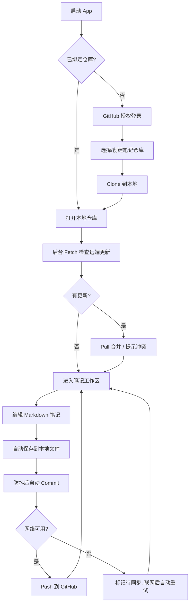

# AINote — 产品需求文档 (PRD)

> 版本：v0.1（MVP 草案） · 状态：已确认 · 维护：PM
> 本文档为活文档，任何需求变更必须先更新本文档，再动代码。

## 1. 产品定位

**一句话定位**：为开发者与知识工作者打造的「Git 即数据库」的跨平台 Markdown 笔记软件——你的笔记就是你的 GitHub 仓库，永远可迁移、可版本回溯、不被平台绑架。

**目标受众**：

- 开发者 / 技术写作者：习惯 Markdown 与 Git 工作流，厌恶厂商锁定。
- 重度知识管理者：需要版本历史、离线可用、多设备同步。

**核心价值闭环**：本地离线编辑 → Git 提交（版本化）→ 推送 GitHub（多端同步）→ 任意设备拉取续写。

**非目标（MVP 明确不做）**：

- 多人实时协作。
- 自建同步服务器——同步只走 Git 协议。
- 富文本（Notion 式）的块级协作与插件化排版——MVP 提供可选「真富文本」笔记类型（TipTap JSON 存储，`.ainote`），但仅覆盖基础排版（标题/正文/列表/引用/代码/分割线），不做块拖拽、实时协作与插件系统。

## 2. 核心 User Story

### P0（MVP，功能闭环必需）

| ID | User Story | 验收要点 |
|---|---|---|
| P0-1 | 作为用户，我可以绑定一个 GitHub 仓库（新建或已有）作为笔记库 | OAuth/PAT 授权；仓库存在性与可写性校验 |
| P0-2 | 作为用户，我可以创建、编辑、删除笔记 | 通过统一「+」创建菜单选择 Markdown / 真富文本；按当前目录立即创建空白笔记，默认文件名为本地日期（`YYYY-MM-DD.md` / `YYYY-MM-DD.ainote`），同日重名自动追加序号；创建后自动打开并聚焦编辑器。Markdown 默认 CodeMirror 软渲染（WYSIWYG）所见即所得编辑，富文本走 TipTap；两种类型均支持自动保存（防抖）与新建笔记即时本地 commit（`note: create <path>`） |
| P0-3 | 作为用户，我可以用文件夹组织笔记 | 目录树增删改；支持新建文件夹；笔记在目录间移动 |
| P0-4 | 作为用户，我的修改会一键 Commit + Push 到 GitHub | 同步状态可见（同步中/已同步/待同步/冲突） |
| P0-5 | 作为用户，我可以在另一台设备 Pull 拉取最新笔记 | 启动时自动检查 + 手动触发 |
| P0-6 | 作为用户，断网时仍可正常浏览和编辑，联网后再同步 | 本地 Git 仓库完整离线可用；待同步队列联网自动重试 |

### P1（MVP 后迭代）

| ID | User Story |
|---|---|
| P1-1 | 查看单篇笔记的 Git 版本历史并回滚 / 对比 Diff ✅ 已实现（v0.3：版本历史面板 + Diff + 恢复此版本） |
| P1-2 | 全文搜索（标题 + 正文） ✅ 已实现（v0.3：Cmd+K 命令面板） |
| P1-3 | 合并冲突的图形化处理（三栏对比） ✅ 已实现（v0.3：本地|合并结果|远端三栏行级挑选 + 手动编辑，全部解决自动 push） |
| P1-4 | 图片/附件管理（存入仓库 `assets/` 并自动插入引用） ✅ 已实现（v0.3：拖放/工具栏选择器导入并自动插入引用，预览渲染本地图片） |
| P1-5 | 标签系统与双链（`[[wiki-link]]`） ✅ 已实现（v0.3：`#标签` 提取 + `[[双链]]` 预览点击跳转 + 反向链接面板 + 侧边栏标签索引） |
| P1-6 | 移动端支持（iOS/Android，Tauri 2 Mobile） |
| P1-7 | 作为用户，我可以在「设置」中管理多个笔记仓库 | 添加（绑定已有 / 新建）、重命名展示名、移除（仅解除绑定，不删除本地数据）、切换当前活动仓库 |
| P1-8 | 作为用户，我可以在「设置」中切换应用主题（亮色 / 暗色 / 跟随系统），并为 Markdown 与富文本编辑器选择阅读主题 | 应用主题为全局 UI 态，支持亮色 / 暗色 / 跟随系统，偏好持久化到本地（重启后保持），默认亮色；阅读主题提供经典 / 纸张 / 森林 / 海盐（亮色系）与夜航 / 石墨 / 墨蓝 / 暖暗（暗色系）八套方案，Markdown 与富文本共用，切换即时生效并持久化；字号 / 行高 / 阅读宽度 / 字体族与配色解耦、独立设置 ✅ 已实现（v0.21） |
| P1-9 | 作为用户，我可以从 GitHub Releases 检查并安装软件更新 | 更新包必须通过 Tauri updater 签名校验；下载完成后用户确认安装并自动重启；更新失败不影响本地笔记 |
| P1-10 | 作为用户，我可以切换应用显示语言（简体中文 / English） | 设置中可切换；默认简体中文；偏好持久化，重启后保持；全部前端界面文案、提示与无障碍标签即时切换 |
| P1-11 | 作为用户，我可以在富文本笔记中使用增强编辑能力 | ✅ 已实现（完整版）：表格 / 图片导入、`[[双链]]` 可视化 mark、斜杠命令、块级操作（气泡菜单）、任务列表、`#标签` 可视化 + 点击跳转标签索引、Markdown/富文本互转导出、一键转换笔记类型（`.md` ↔ `.ainote`） |
| P1-12 | 作为用户，我可以把 Markdown / 富文本笔记导出为 PDF | ✅ 已实现：编辑器工具栏「导出 PDF」打开全屏打印预览（A4 浅色排版，图片 / 表格 / 代码 / 公式 / Mermaid / 双链按笔记类型渲染），点击「打印」经系统打印对话框选择「存储为 PDF」导出；打印前自动落盘，导出不影响笔记内容 |

### P2（远期）

| ID | User Story |
|---|---|
| P2-1 | 软删除回收站：删除笔记/目录移入仓库 `.trash/`（隐藏、Git 版本化、随仓库同步），侧边栏「回收站」可恢复 / 彻底删除 / 清空 ✅ 已实现（v0.3：恢复自动处理重名，清空二次确认） |
| P2-2 | 协作（多人实时） |
| P2-3 | 插件系统 |
| P2-4 | 端到端加密仓库 |

### 2.6 AI 能力（新增，详细设计见 `docs/AI_PRODUCT_DESIGN.md`）

**定位**：可选的写作增强 + 知识问答助手，延续「本地优先、数据主权」价值观；未配置时产品完整可用。

**P0（本次交付）**

| ID | User Story |
|---|---|
| P0-AI-1 | 在「设置 → AI」管理多个 Provider（OpenAI 兼容 API / Ollama），每个 Provider 下维护多个模型并独立启用；设置全局默认模型；AI 菜单与问答面板可选择本次模型；Key 加密存储，前端拿不到明文 |
| P0-AI-2 | 编辑器（Markdown + 富文本）选中文本一键「润色 / 翻译 / 缩写 / 扩写」，结果预览后替换选区 |
| P0-AI-3 | 光标处 AI 续写当前笔记，结果插入光标处 |
| P0-AI-4 | 「AI 问答」面板基于当前笔记（可选全库关键词检索上下文）提问，回答渲染 Markdown 并可插入笔记 |

**P1**：流式输出 ✅ 已实现、摘要生成 ✅ 已实现、标题/大纲建议 ✅ 已实现、标签与双链建议、代码解释。**P2**：向量语义问答、每日回顾、本地模型管理、多模型对比。

**关键业务规则**：上下文默认仅当前笔记，全库上下文只取关键词 top-k 段落（默认 5 段）；每次请求均由用户显式触发；AI 输出先预览再落笔，落笔后照常进入防抖保存与 Git 提交链路；回答渲染走既有 sanitize 管线。

## 3. 核心业务流程

## 4. 关键业务规则

- **笔记即文件**：一篇笔记 = 仓库内一个笔记文件（Markdown `.md` 或真富文本 `.ainote`，后者为 TipTap JSON 文档）；文件夹 = 目录。Markdown 保持纯文本可读；富文本以结构化 JSON 存储以保真，两者均可被 Git 版本化、迁移与恢复。
- **Markdown 软渲染**：Markdown 编辑固定启用 CodeMirror 软渲染（Typora 式 WYSIWYG）——标题、加粗/斜体/删除线、行内代码、代码块、引用/Callout、列表与任务勾选、链接/双链、图片、表格、分割线均直接渲染；行内样式（加粗/斜体/删除线/行内代码）编辑时始终隐藏标记、保持渲染效果，标题/链接/图片/表格等结构元素在光标位于其中时淡显原始标记以便就地编辑。源码 100% 原样保存与提交（Git 保真、全文搜索 / wiki 索引不受影响）。编辑视图固定软渲染、无源码切换入口；分栏视图编辑侧为源码编辑 + 右侧实时预览。预览模式正文限行宽（72ch）并水平居中，大屏阅读不贴边、留白对称；预览/富文本均可开关左侧大纲目录，点击标题跳转定位。
- **自动提交策略**：编辑器变更在停止输入 3s 后落盘，不为每次编辑立即提交；工作区持续空闲 15 分钟后，将所有未提交的笔记、删除和移动操作汇总为一条 `note: auto commit`。点击「一键同步」时也会先汇总提交再 Pull/Push。新建笔记仍立即生成 `note: create <path>` 提交，以保证新文件可恢复；后续编辑不单独提交。工具栏不提供常驻保存按钮，Cmd/Ctrl+S 可立即保存，失败时可重试。
- **推送与版本检查点**：Push 由用户点击「一键同步」触发（未来可配置为退出前或 10～30 分钟定时批量 Push）；提供「保存版本」手动检查点，生成 `note: checkpoint` 提交但不自动 Push。
- **统一创建入口**：文件树顶部只保留一个「+」；菜单提供 Markdown 笔记、真富文本笔记、导入 Markdown 笔记、导入文件、新建文件夹。当前选中目录作为创建位置；目录右键菜单保留「在此创建」快捷入口。
- **PDF 导出**：Markdown 与富文本笔记均可从编辑器工具栏导出 PDF。导出走「打印预览 → 系统打印对话框」：内容以 A4 浅色版式渲染（Markdown 复用预览管线，富文本以 TipTap JSON 序列化 HTML），在打印对话框中选择「存储为 PDF」即生成文件；不落盘中间文件、不写入 Git 仓库。
- **工作区导航**：目录、标签、回收站作为左侧导航轨道中的独立入口；侧栏内容区不再使用顶部 Tab 切换，当前入口以激活态标识。标签与回收站入口分别打开全局标签索引和软删除列表。
- **日期命名**：笔记默认使用设备本地日期命名（`YYYY-MM-DD.md` / `YYYY-MM-DD.ainote`），同目录同日重复创建时追加 `-2`、`-3` 等序号；创建内容始终为空白，用户可在编辑器标题栏或 `F2` 重命名。
- **文件导入**：普通文件通过系统文件选择器或拖放导入，统一存入仓库 `assets/`，重名自动追加序号；不创建无意义的空二进制文件。
- **导入 Markdown 笔记**：统一创建菜单「导入 Markdown 笔记」通过系统文件选择器（`.md` / `.markdown`）选取本地文件，内容作为笔记写入当前选中目录，扩展名统一归一化为 `.md`，重名自动追加 `-1`/`-2`… 序号；导入成功后立即 `note: import <path>` 提交版本化，并自动打开新导入的笔记。与「导入文件」（存 `assets/` 附件）不同，导入笔记进入笔记索引、搜索与双链体系。
- **文件夹即目录**：文件夹 = 仓库内目录；空目录不被 Git 跟踪，首次放入笔记或附件后才会被版本化。
- **冲突策略（MVP）**：Pull 冲突时暂停自动同步，提示用户；图形化解决在 P1-3，MVP 提供「保留本地 / 使用远端」二选一。
- **多仓库管理**：可绑定多个笔记仓库并任选其一作为「活动仓库」，工作区始终作用于活动仓库。添加仓库后自动切换为活动仓库；移除仓库仅解除绑定（从注册表移除），不删除本地克隆数据；移除活动仓库后自动切换到剩余仓库，无仓库则回到首次绑定引导。
- **凭证存储**：GitHub Token 存本地加密文件，绝不落盘明文；登出时删除本地凭证。
- **软删除**：删除笔记/目录不再硬删除，改为移入仓库 `.trash/`（隐藏目录，被搜索/wiki/文件树自动忽略，随仓库 Git 版本化并同步）；侧边栏「回收站」可恢复（原路径被占用时自动追加 `-1`/`-2`…）、彻底删除或清空。
- **软件更新**：桌面端通过 Tauri updater 从 `small-dream/AINote` 的 GitHub Releases 获取 `latest.json`；仅接受内置公钥验证通过的签名资产。Android/iOS 暂不支持自动更新。

## 5. 成功指标（MVP）

- 冷启动到可编辑 < 2s（仓库已克隆时）。
- 1000 篇笔记下目录树渲染与搜索无卡顿（交互 < 100ms）。
- 同步成功率（无冲突场景）≥ 99%。
