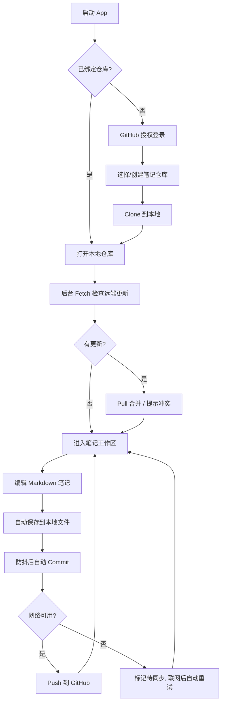

# AINote — 产品需求文档 (PRD)

> 版本：v0.1（MVP 草案） · 状态：已确认 · 维护：PM
> 本文档为活文档，任何需求变更必须先更新本文档，再动代码。

## 1. 产品定位

**一句话定位**：为开发者与知识工作者打造的「Git 即数据库」的跨平台 Markdown 笔记软件——你的笔记就是你的 GitHub 仓库，永远可迁移、可版本回溯、不被平台绑架。

**目标受众**：

- 开发者 / 技术写作者：习惯 Markdown 与 Git 工作流，厌恶厂商锁定。
- 重度知识管理者：需要版本历史、离线可用、多设备同步。

**核心价值闭环**：本地离线编辑 → Git 提交（版本化）→ 推送 GitHub（多端同步）→ 任意设备拉取续写。

**非目标（MVP 明确不做）**：

- 富文本（所见即所得）编辑器——MVP 只做 Markdown 源码 + 预览。
- 多人实时协作。
- 自建同步服务器——同步只走 Git 协议。

## 2. 核心 User Story

### P0（MVP，功能闭环必需）

| ID | User Story | 验收要点 |
|---|---|---|
| P0-1 | 作为用户，我可以绑定一个 GitHub 仓库（新建或已有）作为笔记库 | OAuth/PAT 授权；仓库存在性与可写性校验 |
| P0-2 | 作为用户，我可以创建、编辑、删除 Markdown 笔记 | Markdown 编辑 + 实时预览；支持编辑 / 预览 / 左右分栏（各 50%，可拖拽，编辑与预览同步滚动）三种视图模式；自动保存（防抖）；新建笔记即时本地 commit（`note: create <path>`）；支持默认 / 每日 / 空白三种新建模板 |
| P0-3 | 作为用户，我可以用文件夹组织笔记 | 目录树增删改；支持新建文件夹；笔记在目录间移动 |
| P0-4 | 作为用户，我的修改会一键 Commit + Push 到 GitHub | 同步状态可见（同步中/已同步/待同步/冲突） |
| P0-5 | 作为用户，我可以在另一台设备 Pull 拉取最新笔记 | 启动时自动检查 + 手动触发 |
| P0-6 | 作为用户，断网时仍可正常浏览和编辑，联网后再同步 | 本地 Git 仓库完整离线可用；待同步队列联网自动重试 |

### P1（MVP 后迭代）

| ID | User Story |
|---|---|
| P1-1 | 查看单篇笔记的 Git 版本历史并回滚 / 对比 Diff ✅ 已实现（v0.3：版本历史面板 + Diff + 恢复此版本） |
| P1-2 | 全文搜索（标题 + 正文） ✅ 已实现（v0.3：Cmd+K 命令面板） |
| P1-3 | 合并冲突的图形化处理（三栏对比） ✅ 已实现（v0.3：本地|合并结果|远端三栏行级挑选 + 手动编辑，全部解决自动 push） |
| P1-4 | 图片/附件管理（存入仓库 `assets/` 并自动插入引用） ✅ 已实现（v0.3：拖放/工具栏选择器导入并自动插入引用，预览渲染本地图片） |
| P1-5 | 标签系统与双链（`[[wiki-link]]`） ✅ 已实现（v0.3：`#标签` 提取 + `[[双链]]` 预览点击跳转 + 反向链接面板 + 侧边栏标签索引） |
| P1-6 | 移动端支持（iOS/Android，Tauri 2 Mobile） |
| P1-7 | 作为用户，我可以在「设置」中管理多个笔记仓库 | 添加（绑定已有 / 新建）、重命名展示名、移除（仅解除绑定，不删除本地数据）、切换当前活动仓库 |
| P1-8 | 作为用户，我可以在「设置」中切换应用主题（亮色 / 暗色），并为 Markdown 编辑器与预览选择阅读主题 | 应用主题为全局 UI 态，偏好持久化到本地（重启后保持），默认亮色；编辑器主题提供经典 / 纸张 / 夜航 / 森林四套方案，切换即时生效并持久化 |
| P1-9 | 作为用户，我可以从 GitHub Releases 检查并安装软件更新 | 更新包必须通过 Tauri updater 签名校验；下载完成后用户确认安装并自动重启；更新失败不影响本地笔记 |
| P1-10 | 作为用户，我可以切换应用显示语言（简体中文 / English） | 设置中可切换；默认简体中文；偏好持久化，重启后保持；全部前端界面文案、提示与无障碍标签即时切换 |

### P2（远期）

| ID | User Story |
|---|---|
| P2-1 | 软删除回收站：删除笔记/目录移入仓库 `.trash/`（隐藏、Git 版本化、随仓库同步），侧边栏「回收站」可恢复 / 彻底删除 / 清空 ✅ 已实现（v0.3：恢复自动处理重名，清空二次确认） |
| P2-2 | 协作（多人实时） |
| P2-3 | 插件系统 |
| P2-4 | 端到端加密仓库 |

## 3. 核心业务流程

## 4. 关键业务规则

- **笔记即文件**：一篇笔记 = 仓库内一个 `.md` 文件；文件夹 = 目录。不引入任何私有数据库格式。
- **自动提交策略**：编辑器变更仅在防抖（默认 30s）后落盘，不为每次编辑立即提交；工作区持续空闲（默认 5 分钟）后，将所有未提交的笔记、删除和移动操作汇总为一条 `note: auto commit`。点击「一键同步」时也会先汇总提交再 Pull/Push。新建笔记仍立即生成 `note: create <path>` 提交，以保证新文件可恢复；后续编辑不单独提交。
- **推送与版本检查点**：Push 由用户点击「一键同步」触发（未来可配置为退出前或 10～30 分钟定时批量 Push）；提供「保存版本」手动检查点，生成 `note: checkpoint` 提交但不自动 Push。
- **新建模板**：新建笔记支持「默认（`# 未命名`）/ 每日（日期标题，默认文件名 `YYYY-MM-DD.md`）/ 空白」三种模板；已存在同名笔记时给出提示并幂等打开已有文件。
- **文件夹即目录**：文件夹 = 仓库内目录，可在文件树工具栏或目录节点上新建；空目录不被 Git 跟踪（`note: create <path>` 仅针对笔记文件），首次放入笔记后才会被版本化。
- **冲突策略（MVP）**：Pull 冲突时暂停自动同步，提示用户；图形化解决在 P1-3，MVP 提供「保留本地 / 使用远端」二选一。
- **多仓库管理**：可绑定多个笔记仓库并任选其一作为「活动仓库」，工作区始终作用于活动仓库。添加仓库后自动切换为活动仓库；移除仓库仅解除绑定（从注册表移除），不删除本地克隆数据；移除活动仓库后自动切换到剩余仓库，无仓库则回到首次绑定引导。
- **凭证存储**：GitHub Token 存本地加密文件，绝不落盘明文；登出时删除本地凭证。
- **软删除**：删除笔记/目录不再硬删除，改为移入仓库 `.trash/`（隐藏目录，被搜索/wiki/文件树自动忽略，随仓库 Git 版本化并同步）；侧边栏「回收站」可恢复（原路径被占用时自动追加 `-1`/`-2`…）、彻底删除或清空。
- **软件更新**：桌面端通过 Tauri updater 从 `small-dream/AINote` 的 GitHub Releases 获取 `latest.json`；仅接受内置公钥验证通过的签名资产。Android/iOS 暂不支持自动更新。

## 5. 成功指标（MVP）

- 冷启动到可编辑 < 2s（仓库已克隆时）。
- 1000 篇笔记下目录树渲染与搜索无卡顿（交互 < 100ms）。
- 同步成功率（无冲突场景）≥ 99%。
