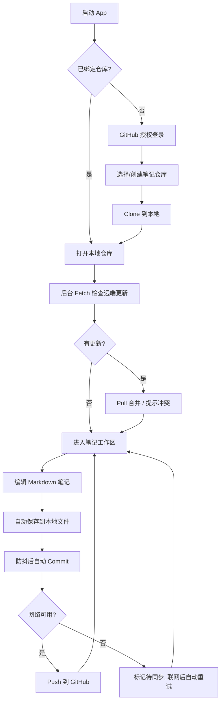

# MyNote — 产品需求文档 (PRD)

> 版本：v0.1（MVP 草案） · 状态：已确认 · 维护：PM
> 本文档为活文档，任何需求变更必须先更新本文档，再动代码。

## 1. 产品定位

**一句话定位**：为开发者与知识工作者打造的「Git 即数据库」的跨平台 Markdown 笔记软件——你的笔记就是你的 GitHub 仓库，永远可迁移、可版本回溯、不被平台绑架。

**目标受众**：

- 开发者 / 技术写作者：习惯 Markdown 与 Git 工作流，厌恶厂商锁定。
- 重度知识管理者：需要版本历史、离线可用、多设备同步。

**核心价值闭环**：本地离线编辑 → Git 提交（版本化）→ 推送 GitHub（多端同步）→ 任意设备拉取续写。

**非目标（MVP 明确不做）**：

- 富文本（所见即所得）编辑器——MVP 只做 Markdown 源码 + 预览。
- 多人实时协作。
- 自建同步服务器——同步只走 Git 协议。

## 2. 核心 User Story

### P0（MVP，功能闭环必需）

| ID | User Story | 验收要点 |
|---|---|---|
| P0-1 | 作为用户，我可以绑定一个 GitHub 仓库（新建或已有）作为笔记库 | OAuth/PAT 授权；仓库存在性与可写性校验 |
| P0-2 | 作为用户，我可以创建、编辑、删除 Markdown 笔记 | Markdown 编辑 + 实时预览；自动保存（防抖） |
| P0-3 | 作为用户，我可以用文件夹组织笔记 | 目录树增删改；笔记在目录间移动 |
| P0-4 | 作为用户，我的修改会一键 Commit + Push 到 GitHub | 同步状态可见（同步中/已同步/待同步/冲突） |
| P0-5 | 作为用户，我可以在另一台设备 Pull 拉取最新笔记 | 启动时自动检查 + 手动触发 |
| P0-6 | 作为用户，断网时仍可正常浏览和编辑，联网后再同步 | 本地 Git 仓库完整离线可用；待同步队列联网自动重试 |

### P1（MVP 后迭代）

| ID | User Story |
|---|---|
| P1-1 | 查看单篇笔记的 Git 版本历史并回滚 / 对比 Diff |
| P1-2 | 全文搜索（标题 + 正文） |
| P1-3 | 合并冲突的图形化处理（三栏对比） |
| P1-4 | 图片/附件管理（存入仓库 `assets/` 并自动插入引用） |
| P1-5 | 标签系统与双链（`[[wiki-link]]`） |
| P1-6 | 移动端支持（iOS/Android，Tauri 2 Mobile） |

### P2（远期）

协作、插件系统、端到端加密仓库。

## 3. 核心业务流程

## 4. 关键业务规则

- **笔记即文件**：一篇笔记 = 仓库内一个 `.md` 文件；文件夹 = 目录。不引入任何私有数据库格式。
- **自动提交策略**：编辑防抖（默认 30s）落盘后自动生成一条 commit，message 规范：`note: <action> <path>`。
- **冲突策略（MVP）**：Pull 冲突时暂停自动同步，提示用户；图形化解决在 P1-3，MVP 提供「保留本地 / 使用远端」二选一。
- **凭证存储**：GitHub Token 存本地加密文件，绝不落盘明文；登出时删除本地凭证。

## 5. 成功指标（MVP）

- 冷启动到可编辑 < 2s（仓库已克隆时）。
- 1000 篇笔记下目录树渲染与搜索无卡顿（交互 < 100ms）。
- 同步成功率（无冲突场景）≥ 99%。
