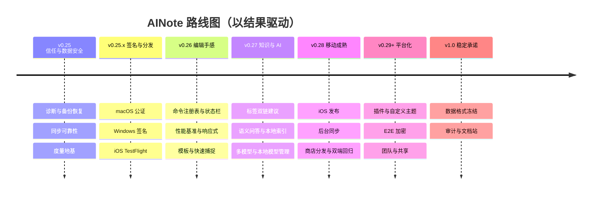

# AINote — 产品路线图 (ROADMAP)

> 版本：v1.0 · 更新日期：2026-09-10 · 基线版本：v0.24.12 · 维护：PM
>
> 本文档回答「**先做什么、后做什么、为什么是这个顺序**」；`docs/PRD.md` 回答「做什么、为什么做」。
> 两者冲突时，**需求范围以 PRD 为准，优先级与排期以本文档为准**。
> 本文档是活文档：里程碑启动前锁定范围，复盘后滚动更新。

---

## 0. 阅读方式

- **里程碑 = 一个可对外讲述的产品叙事 + 一组可验证的退出标准**，不是功能清单堆叠。
- 状态标记：✅ 已完成 · 🚧 进行中 · 📋 计划 · 🧊 暂缓 / 待评估。
- 每个里程碑完成后必须复盘，并同步更新本文档与对应活文档（PRD / ARCHITECTURE / CODING_STANDARDS）。
- 任何跨端改动必须声明 `Desktop Impact` 与 `Mobile Impact`，门禁见 `docs/CODING_STANDARDS.md` §5.2。

---

## 1. 现状诊断（v0.24.12）

### 1.1 已经建立的能力

| 领域 | 现状 | 判断 |
|---|---|---|
| 笔记核心闭环 | 绑定/新建仓库、创建/编辑/移动/删除、目录树、多仓库切换、软删除回收站 | ✅ 完整 |
| Git 原生同步 | 一键同步、启动检查、离线可用、待同步重试、三栏冲突合并、版本历史 / Diff / 回滚 | ✅ 完整，接近同类上限 |
| 知识网络 | `[[双链]]`、反向链接与出链、`#标签` 索引、全文搜索、命令面板、收藏、最近 | ✅ 核心可用 |
| 编辑体验 | CodeMirror 软渲染 WYSIWYG、源码/分栏/预览、表格就地编辑、大纲、Markdown 诊断、富文本 TipTap、PDF 导出 | ✅ 广度充足，细节待收口 |
| AI 写作 | 多 Provider/多模型、流式、润色/翻译/缩写/扩写/续写、摘要、标题/大纲建议、创作/审查/优化、全库关键词问答 | ✅ P0 + P1 大部分完成 |
| 跨端 | 桌面 macOS(Apple Silicon)/Windows/Linux；Android arm64 APK/AAB 已发布；移动端单栏壳与返回栈 | 🚧 Android 已发布，iOS 未发布 |
| 分发与更新 | 桌面 Tauri updater 签名校验；Android 签名 Release；主题/语言/排版偏好 | 🚧 桌面未做平台签名（M1.5 补） |

### 1.2 关键缺口（按用户影响排序）

| # | 缺口 | 用户影响 | 现状证据 |
|---|---|---|---|
| 1 | **安装信任缺失** | 陌生用户首次安装即被 Gatekeeper / SmartScreen 拦截，转化漏斗第一道坎 | macOS 未公证、Windows 未签名；README 需教用户执行 `xattr -cr`。**证书签名归 M1.5，M1 先用 `SHA256SUMS` + 放行文档缓解** |
| 2 | **数据可恢复性不足** | 长期托管数据的核心顾虑；出问题时缺诊断与恢复路径 | 无崩溃/错误诊断、无备份/导出整库入口、无仓库完整性检查 |
| 3 | **编辑器体验未收口** | 高频用户每天用数小时，细节缺失会被持续放大 | 无统一命令注册表、无字数/行列状态、无专注模式、查找替换 UI 与分栏 a11y 未闭环、<900px 响应式未收口、5000 行性能基准未建立 |
| 4 | **知识闭环不完整** | 知识管理者「沉淀 → 连接 → 回顾」只完成前两步 | 模板仅有默认/每日/空白三种内置选项，无模板库与自定义模板；无每日笔记流、快速捕捉、关系图谱、语义检索 |
| 5 | **AI 护城河未形成** | AI 目前是「好用」，还不是「非它不可」 | 标签/双链建议、代码解释、语义问答、多模型对比、本地模型管理均未做 |
| 6 | **移动成熟度不足** | 手机上「能用」但不算「主力」 | iOS 未发布、无后台同步、无应用商店分发、无移动端更新链路 |
| 7 | **生态与规模化未启动** | 无法被社区放大，也进不了团队场景 | 插件系统、自定义主题、E2E 加密、协作均为 P2 |
| 8 | **可度量性缺失** | 成功指标已定义，但无法验证 | 无 opt-in 埋点/诊断数据，指标停留在纸面 |

### 1.3 一句话结论

> **功能广度已进入同类第一梯队，但「信任 — 打磨 — 护城河」尚未闭环。**
> 下一阶段主线不是继续加功能，而是把 AINote 从「功能齐全的 Beta」变成「敢当主力笔记库的 1.0」。

---

## 2. 战略与取舍

### 2.1 目标用户（保持）

- 开发者 / 技术写作者：习惯 Markdown 与 Git，厌恶厂商锁定。
- 重度知识管理者：需要版本历史、离线可用、多设备同步。
- 新增细分机会：**愿意为「数据主权 + AI 助手」付费的隐私敏感用户**。

### 2.2 三条战略主线

| 主线 | 要回答的问题 | 为什么现在 |
|---|---|---|
| **Trust 信任优先** | 用户敢把长期笔记托付给 AINote 吗？ | 数据主权产品的转化与留存前提，且工程上一次性投入可长期受益 |
| **Craft 核心循环卓越** | 每天用两小时，顺手吗？ | 笔记软件是高频工具，手感决定留存 |
| **Leverage AI 差异化** | 为什么是 AINote，而不是别的笔记 + ChatGPT？ | AI 基于「你自己的 Git 笔记库」，是唯一难以被复制的护城河 |

### 2.3 本阶段明确不做

- 不做私有云同步服务器 / 自建后端——同步只走 Git 协议。
- 不做私有块数据库 / 牺牲文件可迁移性。
- 不做实时多人协作——在 Git 模型没有无损方案前不投入（P2 评估项）。
- 不默认开启遥测——所有数据采集 opt-in、脱敏、可关闭、可导出。
- 不为增加平台数量而牺牲已有平台质量。

---

## 3. 北极星与指标体系

### 3.1 北极星指标

**Weekly Synced Writers（每周有效写作并成功同步的用户数）**
——同时约束「真的在用」与「真的在同步」，避免只看安装量。

### 3.2 输入指标（漏斗）

| 环节 | 指标 | 目标（首版，待埋点校准） |
|---|---|---|
| 安装 → 绑定仓库 | 首次绑定成功率 | ≥ 85% |
| 绑定 → 第一篇笔记 | 首次创建笔记耗时 | < 3 分钟 |
| 留存 | D7 / D30 留存 | 建立基线后逐里程碑提升 |
| 使用深度 | 周均有效编辑天数 | ≥ 3 天 |
| 同步健康 | 无冲突同步成功率 | ≥ 99% |
| AI 价值 | AI 输出确认落笔率 | ≥ 80% |

### 3.3 质量护栏（任何里程碑不得突破）

- **数据丢失事件 = 0**（最高优先级，一票否决）。
- 崩溃自由会话 ≥ 99.5%；崩溃可定位到版本与堆栈。
- 已克隆仓库冷启动到可编辑 < 2s。
- 1000 篇笔记下目录树与搜索交互 < 100ms。
- 各主题正文 / 代码 / 链接对比度满足 WCAG AA。

### 3.4 度量原则

本地优先、opt-in、脱敏、可关闭、可导出；绝不采集笔记内容、Token 或 API Key。

---

## 4. 路线图总览

| 里程碑 | 主题 | 目标版本 | 一句话目标 | 状态 |
|---|---|---|---|---|
| M1 | 信任与数据安全 | v0.25 | 让用户敢长期托管数据，出问题能定位、能恢复 | 📋 |
| M1.5 | 签名与分发 | v0.25.x | 消除 macOS / Windows 安装拦截，打通 iOS 内测 | 🧊 |
| M2 | 编辑手感与日常循环 | v0.26 | 让每天两小时的使用足够顺手 | 📋 |
| M3 | 知识网络与 AI 护城河 | v0.27 | 让「AI + 你的 Git 笔记库」成为非它不可的理由 | 📋 |
| M4 | 移动成熟与跨端一致 | v0.28 | 让手机端从「能用」变成「好用」 | 📋 |
| M5 | 平台化与规模化 | v0.29+ | 让社区与团队放大产品价值 | 🧊 |
| v1.0 | 稳定承诺 | v1.0 | 数据格式与迁移的长期承诺 | 📋 |

> 节奏建议：每个里程碑 4–6 周，以退出标准是否达成决定是否进入下一里程碑，而不是以日期推进。

---

## 5. 里程碑详情

### M1 — 信任与数据安全（v0.25）📋

> 可执行任务清单见 `docs/M1_TRUST_PLAN.md`（23 个任务卡，其中 3 个签名类任务 🧊 暂缓至 M1.5）。
> **范围说明（2026-09-10）**：代码签名 / 证书 / 应用商店相关任务当前阶段不启动、不占工期，移入 M1.5；M1 聚焦可诊断、可恢复、同步可靠与度量地基。

**要回答的问题**：用户愿意把长期笔记托付给 AINote 吗？

**为什么最优先**：功能再多，如果数据出问题时无从恢复、无法定位，产品就无法进入「主力工具」心智。签名能解决安装转化，但依赖采购与外部账号；M1 先用零成本方式把「数据可信、问题可查」做扎实，签名在 M1.5 补齐。

**交付范围**

1. **分发与校验（零证书成本）**
   - 全平台 Release 产出 `SHA256SUMS` + GPG 签名，文档给出可复制的校验命令。
   - 未签名平台（macOS / Windows）的安装限制写入 `docs/TROUBLESHOOTING.md`，提供校验与放行步骤。
   - Android 内置更新提示；iOS TestFlight 与桌面平台证书签名归 M1.5。
2. **可诊断性（opt-in）**
   - Rust + 前端结构化本地日志，支持一键导出诊断包（自动脱敏路径、Token、API Key）。
   - 崩溃 / 同步失败 / 保存失败的 opt-in 上报，含版本、平台、堆栈，不含笔记内容。
   - 设置页新增「诊断与反馈」入口。
3. **数据安全与可恢复性**
   - 仓库完整性检查（Git 对象、工作区、索引一致性）与可读修复建议。
   - 整库备份 / 一键导出（zip 或 Git bundle）与恢复引导。
   - 删除、冲突、同步失败三类故障均提供明确的可恢复路径。
   - 建立「故障恢复演练」清单，纳入发布前检查。
4. **同步可靠性**
   - 大仓库性能基准：1000 篇笔记 / 5000 行单篇 / 20MB 附件。
   - 网络中断、限流、凭证失效的重试与可读错误提示。
   - 同步失败原因可定位到文件与操作。
5. **度量地基**
   - opt-in 埋点，覆盖第 3 节漏斗指标与质量护栏。

**退出标准**

- 全平台 Release 提供 `SHA256SUMS` + GPG 校验；未签名平台（macOS / Windows）的安装限制在 `docs/TROUBLESHOOTING.md` 明示，并给出一键校验与放行步骤。
- 断网 / 崩溃 / 误删三类故障演练全部通过，且不丢数据。
- 无冲突同步成功率 ≥ 99%，P0 数据丢失缺陷 = 0。
- 任一崩溃可定位到版本与堆栈；诊断包不含敏感信息。

---

### M2 — 编辑手感与日常循环（v0.26）📋

**要回答的问题**：每天用两小时，顺手吗？

**交付范围**

1. **编辑器能力收口**（对齐 `docs/EDITOR_EXPERIENCE_PLAN.md` 未完成项）
   - 统一命令注册表：工具栏、快捷键、命令面板复用同一份命令定义。
   - 状态栏：字数 / 行列 / 保存状态；专注模式；撤销 / 重做显式入口。
   - 查找替换 UI 完善；多行粘贴保持缩进。
   - 分栏分割线支持键盘调整与 `aria-valuemin/max/now`。
   - < 900px 响应式单栏收口，≥1200px 可选分栏。
2. **性能**
   - Markdown 解析 / 语法高亮 / 大文档预览迁移到 Worker 或可取消任务。
   - 5000 行文档输入、滚动、查找无明显卡顿；1000 篇笔记目录与搜索 < 100ms。
3. **快速捕捉**
   - 桌面全局快捷键 / 托盘快速新建；移动端从任意位置快速新建。
4. **模板与日记流**
   - 模板体系升级：在现有默认 / 每日 / 空白模板基础上，支持自定义模板文件与模板库。
   - 每日笔记：日期命名、模板填充、上一天 / 下一天导航。
5. **搜索增强**
   - 结果高亮、类型/目录筛选、搜索历史。

**退出标准**

- 高频编辑动作可完全键盘完成。
- 5000 行文档与 1000 篇笔记性能基准达标。
- 编辑器相关体验指标（输入到预览 P95 < 120ms）达标。
- 桌面与移动端各验证一次，无跨端回归。

---

### M3 — 知识网络与 AI 护城河（v0.27）📋

**要回答的问题**：为什么是 AINote，而不是别的笔记 + ChatGPT？

**交付范围**

1. **AI 能力补全**（对齐 `docs/AI_PRODUCT_DESIGN.md` P1/P2）
   - 标签与双链建议，复用现有 `#标签` / `[[双链]]` 索引。
   - 代码块解释与生成（识别语言上下文）。
   - 多模型对比与 A/B 选择。
   - 本地模型管理：Ollama 模型下载 / 切换 / 离线可用状态。
2. **语义知识问答**
   - embedding + 向量检索，超越关键词 top-k。
   - 索引可重建、可关闭；提供「数据不出设备」的本地索引选项。
   - 明确上下文边界与 token 上限，延续「不发送整个仓库」原则。
3. **知识沉淀闭环**
   - 每日回顾 / 闪卡生成。
   - 未链接提及（Unlinked mentions）与可选关系图谱视图。
4. **隐私与可控**
   - 所有 AI 动作显式触发、结果先预览后落笔、可撤销。
   - 向量索引与 AI 数据边界写入 PRD 与设置页说明。

**退出标准**

- AI 输出确认落笔率 ≥ 80%。
- 语义问答 P95 延迟与召回达到设定基线；单次请求 token ≤ 8000。
- 向量索引可从零重建，且可完全关闭。
- AI 生成内容照常进入 Git 版本链路，可回溯、可审计。

---

### M4 — 移动成熟与跨端一致（v0.28）📋

**要回答的问题**：手机上是「能用」还是「好用」？

**交付范围**

1. **iOS 正式发布**
   - 补齐 libgit2 的 zlib/iconv 链接配置，完成 Archive。
   - TestFlight → App Store 提审；Apple 签名与分发流程固化。
2. **后台同步（尽力而为）**
   - Android WorkManager、iOS BGTask；明确「不保证被系统杀死后仍同步」的边界。
   - 移动端冲突处理体验对齐桌面（保留本地 / 使用远端，逐步增强）。
3. **移动端能力补齐**
   - 分享 / 导出 PDF（走系统分享或打印能力可用时接入）。
   - 移动端更新提示 / 商店分发。
   - 大仓库、低内存、磁盘不足场景的提示与降级。
4. **跨端质量**
   - Maestro / Appium 覆盖登录、创建、编辑、返回、离线、同步、附件、冲突。
   - 真机矩阵：iOS 小屏 + 大屏；Android 低内存 + 主流大屏。
   - 双端回归纳入发布门禁。

**退出标准**

- iOS 与 Android Release 构建可安装并启动。
- 核心闭环（授权 → clone → 离线编辑 → commit → 前台同步）在真机矩阵通过。
- 桌面现有测试无回归，跨端影响在 PR 描述中均有证据。
- Token / API Key 不出现在前端状态与日志。

---

### M5 — 平台化与规模化（v0.29+）🧊

**要回答的问题**：如何让社区和团队放大产品价值？

**候选范围（需逐项评估，不默认全部进入）**

- **插件系统 + 自定义主题**：插件 API 稳定版、安全沙箱模型、本地安装优先、主题 JSON token 导入。
- **E2E 加密仓库（可选）**：威胁模型文档、密钥管理、与 Git 远端协作的兼容性。
- **团队 / 共享仓库**：基于 Git 权限的只读分享、团队模板。
- **多人实时协作**：仅当 Git 模型出现无损方案时评估；否则保持暂缓。

**进入条件**

- M1–M4 的质量护栏稳定；
- 插件 API 完成安全评审与版本化设计；
- 有明确的用户需求证据，而非竞品有所以要做。

---

### v1.0 — 稳定承诺 📋

- **数据格式冻结**：`.md` / `.ainote` / `.ainote/favorites.json` 等格式给出长期兼容与迁移承诺。
- **SemVer 与弃用策略**：破坏性变更提前一个 Minor 版本公告。
- **文档站**：安装、迁移、同步故障排查、AI 隐私说明。
- **审计**：无障碍（键盘 / 对比度 / 减少动画）、安全、性能基准公开。

---

## 6. 优先级评分（候选池）

> 评分仅用于排序讨论，不替代战略判断。RICE = Reach × Impact × Confidence ÷ Effort。

| 候选 | Reach | Impact | Confidence | Effort | 建议 |
|---|---|---|---|---|---|
| 平台签名与公证 | 高 | 高 | 高 | 中 | **M1.5 做**（证书 / 账号依赖，M1 暂缓） |
| 诊断 / 备份 / 恢复 | 高 | 高 | 中 | 中 | **M1 立即做** |
| 同步可靠性与大仓库基准 | 高 | 高 | 中 | 中 | **M1 立即做** |
| 编辑器能力收口 | 高 | 中 | 高 | 中 | **M2 做** |
| 模板 / 日记 / 快速捕捉 | 中 | 高 | 中 | 中 | **M2 做** |
| 语义问答 | 中 | 高 | 中 | 高 | **M3 做** |
| 标签 / 双链建议 | 中 | 中 | 高 | 低 | **M3 优先做** |
| 多模型对比 / 本地模型管理 | 中 | 中 | 中 | 中 | M3 |
| iOS 发布 | 中 | 高 | 中 | 高 | **M4 做** |
| 后台同步 | 中 | 中 | 低 | 高 | M4（尽力而为） |
| 插件系统 | 低 | 高 | 中 | 高 | M5，先做安全模型 |
| E2E 加密 | 低 | 中 | 低 | 高 | M5，先做威胁模型 |
| 实时协作 | 低 | 中 | 低 | 极高 | 🧊 暂缓 |

---

## 7. 依赖、风险与应对

| 风险 | 影响 | 应对 |
|---|---|---|
| 🧊 Apple / Windows 签名证书与账号成本、流程复杂 | M1.5 进度 | 已从 M1 剥离；预算批准后优先 SignPath 免费方案，流程写入 `docs/RELEASE.md` 并自动化 |
| 未签名安装体验影响下载转化 | M1 转化 | `docs/TROUBLESHOOTING.md` 提供校验与放行；发布说明透明；M1.5 优先补齐签名 |
| 🧊 iOS libgit2 zlib/iconv 链接与真机签名 | M1.5 / M4 进度 | M1.5 完成 TestFlight 内测，提前暴露问题 |
| 大仓库 / 大量笔记性能退化 | 核心体验 | M1 建立基准，M2 迁移 Worker 并持续回归 |
| 语义检索的隐私与成本 | 信任与费用 | 本地索引选项、可关闭、token 上限、显式触发 |
| 插件安全模型不成熟 | 生态与安全 | M5 先出威胁模型与权限清单，再开放 API |
| 协作与 Git 模型冲突 | 数据一致性 | 保持暂缓，除非出现无损方案 |
| 埋点与隐私价值观冲突 | 信任 | 全程 opt-in、脱敏、可关闭、可导出；不采集笔记内容 |

---

## 8. 复盘与更新机制

- 每个里程碑结束召开复盘：退出标准逐条核对，未达标项顺延并说明原因。
- 复盘产出：本文档状态更新 + PRD / ARCHITECTURE / CODING_STANDARDS 同步 + 下一里程碑范围锁定。
- 新增需求先进入第 6 节候选池，按 RICE 与战略主线排序，不直接插队。
- 发布门禁保持：`pnpm build && pnpm test && pnpm lint` 与 `cargo test` 全绿。

---

## 9. 附录：PRD 条目与路线图映射

| PRD 条目 | 状态 | 归属里程碑 |
|---|---|---|
| P0-1 ~ P0-6 核心闭环 | ✅ 已完成 | — |
| P1-1 ~ P1-5、P1-7 ~ P1-14 | ✅ 已完成 | — |
| P1-6 移动端支持 | 🚧 Android 已发布，iOS 未发布 | M4 |
| P0-AI-1 ~ P0-AI-4 | ✅ 已完成 | — |
| P1-AI-1 ~ P1-AI-4 | ✅ 已完成 | — |
| P1-AI-5 标签与双链建议 | 📋 | M3 |
| P1-AI-6 代码解释 / 生成 | 📋 | M3 |
| P2-AI-1 语义问答 | 📋 | M3 |
| P2-AI-2 每日回顾 / 闪卡 | 📋 | M3 |
| P2-AI-3 本地模型管理 | 📋 | M3 |
| P2-AI-4 多模型对比 | 📋 | M3 |
| P2-2 协作（多人实时） | 🧊 | M5 评估 |
| P2-3 插件系统 | 🧊 | M5 |
| P2-4 端到端加密仓库 | 🧊 | M5 |
| 编辑器体验计划未完成项 | 📋 | M2 |
